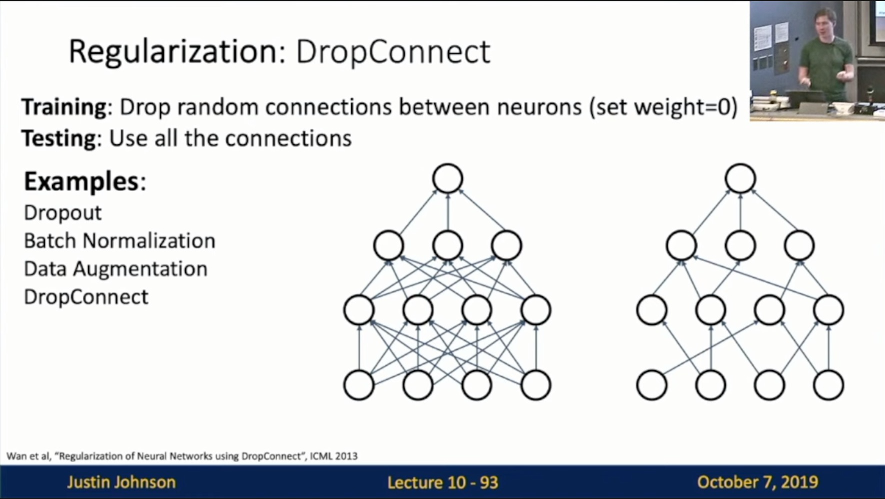

Michigan Online  
Deep Learning for Computer Vision  
Instructor: Justin Johnson  

Lecture 10: Training Neural Networks I

**Overview**
- One time setup (Today)
    - Activation functions
    - Data preprocessing
    - Weight initialization
    - Regularization
- Training dynamics (Next time)
    - Learning schedules
    - Large-batch training
    - Hyperparameter optimization
- After training
    - Model ensembles
    - Transfer learning(Next time)
 

**Activation Functions**
- Slide 10-9: A zoo of activation functions
	 

- Sigmoid: Slide 10-19
    - Squashes numbers to range [0, 1]
    - Historically popular since they have nice interpretation as a saturating “firing rate” of a neuron
    - 3 problems
        - Saturated neurons “kill” the gradients
            - JJ: when x too big or too small, would make many downstream gradients close to zero, causing slow learning
            - JJ: x near zero would be a sweet spot 
            - JJ: Most problematic aspect of the 3 problems
        - Sigmoid outputs are not zero-centered
            - Slide 10-17
                - All positive
                - JJ: when the input (x_i) to a neuron is always positive, the gradients on w would be always all positive or all negative —> very difficult to gradient descent
                - Minibatches help!
             
        - exp() is a bit compute expensive 
            - JJ: for GPU, less concern
     
- Tanh: Slide 10-20
    - Squashes numbers to range [-1, 1]
    - Zero centered (nice)
    - Still kills gradients when saturated (bad)
    - JJ: rescaled sigmoid 
     
- ReLU: Slide 10-23
    - Good
        - Does not saturate (in +ve region)
        - Very computationally efficient
        - Converges much faster than sigmoid/tanh in practice (e.g. 6x)
    - Bad
        - Not zero-centered output 
        - An annoyance 
            - JJ: when x is less than zero, all the gradients would be completely zero —> dead ReLU
            - Dead ReLU (Slide 10-25)
                - Will never activate
                - Never update
             
        - One trick: Sometimes initialize ReLU neurons with slightly positive biases (e.g. 0.01)
            - JJ: Less people use it now
     
- Leaky ReLU: Slide 10-28
    - Good
        - Does not saturate
        - Computationally efficient
        - Converges much faster than sigmoid/tanh in practice! (e.g. 6x)
        - Will not “die” 
            - Compared to ReLU
    - Bad
        - JJ: 0.01 is a hyperparameter, causing us to search
    - Parametric Rectifier (PReLU)
        - f(x) = max(alpha x, x)
        - Backprop into \alpha (parameter)
     
- Exponential Linear Unit (ELU): Slide 10-29
    - Good
        - All benefits of ReLU
        - Closer to zero mean outputs
        - Negative saturation regime compared with Leaky ReLU adds some robustness to noise
    - Bad
        - Computation requires exp()
     
- Scaled Exponential Linear Unit (SELU): Slide 10-30
    - Good
        - Scaled version of ELU that works better for deep networks
        - “Self-Normalizing” property; can train deep SELU networks without BatchNorm
    - Bad
        - Derivation takes 91 pages of math in appendix
     
- Summary
    - Don’t think too hard. Just use ReLU
    - Try out Leaky ReLU/ELU/SELU/GELU if you need to squeeze that last 0.1%
    - Don’t use sigmoid or tanh

**Data Preprocessing**
- Zero-centering & Normalization
    - Slide 10-35
        - Make it meanable to efficient training
         
    - Slide 10-36
        - Don’t make gradients all positive/negative —> quicker with zero-mean data
         
- PCA & Whitening (decorrelation + normalization)
    - Slide 10-38
     
- Normalization (From prospective of linear classifier)
    - Slide 10-39
        - Easier to optimize after normalization 
     
- Data Preprocessing for Images
    - Subtract the mean image (e.g. AlexNet)
    - Subtract per-channel mean (e.g. VGGNet)
    - Subtract per-channel mean and divide by per-channel std (e.g. ResNet)
    - Not common to do PCA or whitening

**Weight Initialization**
- Warmup
    - Question: What happens if we initialize all W=0, b=0?
    - Answer: All outputs are 0, all gradients are the same! No “Symmetry breaking”
- Next idea: **small random numbers**
    - Example: Gaussion with zero mean, std=0.01
        - Works ~okay for small networks, but problems with deeper networks
            - Slide 10-48
                - All activations tend to zero for deeper network layers —> all the gradients are going to be zero (bad)
         
    - Example: Gaussion with zero mean, std=0.05
        - Bad
            - Slide 10-51
                - All activation saturate —> Local gradients all zero, no learning
         
    - Xavier Initialzation
        - Std = 1/sqrt(Din)
            - Input dimension 
        - Slide 10-54
            - “Just right”: Activation are nicely scaled for all layers!
            - Derivation: Variance of output = variance of input
                - Takeaway: If Var(w_i) = 1/Din, then Var(y_i) = Var(x_i)
         
        
        - Problem: What about ReLU?
            - Slide 10-61
                - Xavier assumes zero-centered activation function —> When using ReLU, activations collapse to zero again, no learning
         
    - Kaiming/MSRA Initialization
        - ReLU correction: std = sqrt(2/Din)
        - Slide 10-62
            - “Just right” - activations nicely scaled for all layers
         
    - Residual Networks: Slide 10-64
        - If we initialize with MSRA: then Var(F(x)) = Var(X), then Var(F(x) + x) > Var(x) —> variance grows with each block!
        - Solution: Initialization first conv w/ MSRA, initialize second conv to zero. Then Var(x + F(x)) = Var(x)
       

**Regularization**
- Motivation: Now your model is training… but if overfits!
- Add term to the loss
    - L2 regularization
    - L1 regularization
    - Elastic net (L1+L2)
- Dropout
    - Slide 10-68
        - In each forward pass, randomly set some neurons to zero
        - Probability of dropping is a hyperparameter; 0.5 is common
     
    
    - Implementation example (Train): Slide 10-69
     
    
    - Why do dropout: 
        - Slide 10-70
            - Forces the network to have a redundant representation; Prevents **co-adaption** of features
         
        
        - Slide 10-71
            - Dropout is training a large **ensemble** of models (that share parameters).
            - Each binary mask is one model
         
    - Problems
        - Problem: Slide 10-72
            - Dropout makes our output random!
            - Want to “average out” the randomness at test-time, but hard to integrate
         
        
        - Solution: 10-76
            - Want to approximate
            - At test time, drop nothing and **multiply** by dropout probability
         
        
    - Implementation example (Predict): Slide 10-77
     
    
    - Implementation example (Train + Predict): Slide 10-78
     
    
    - Example: Inverted dropout (Slide 10-79)
        - JJ: Basically do the same thing (of the previous slide), but test time is unchanged
     
    
    - Dropout Architectures: Slide 10-81
        - GoogLeNet: They don’t use dropout at all since they use global average pooling instead
     
    
- A Common Pattern
    - **Training**: Add some kind of randomness
    - **Testing**: Average out randomness (sometimes approximate)
        - In other words, marginalize over randomness
    - **Example**: Batch Normalization
        - **Training**: Normalize using stats from random minibatches
        - **Testing**: Use fixed stats to normalize
    - For ResNet and later, often **L2 and Batch Normalization** are the only regularizers!
- Data Augmentation 
    - JJ:
        - It actually works as a regularization
        - Multiply your training sets
        - Get creative for your problem!
    - Example: Slide 10-86
     
    
    - Transform
        - Horizontal Flips
        - Random Crops and Scales
            - Slide 10-89
             
        - Color Jitter
- Other ways to regularize
    - DropConnect: Slide 10-93
     
    
    - Fractional Max Pooling: Slide 10-94
     
    
    - Stochastic Depth: Slide 10-95
     
    
    - Cutout: 10-96
     
    
    - Mixup: 10-97
     
    
- Which regularization should you use
    - Consider dropout for large fully-connected layers
        - JJ: Not used quite so much these days
    - **Batch normalization and data augmentation almost always a good idea**
    - Try cutout and mixup especially for small classification datasets
