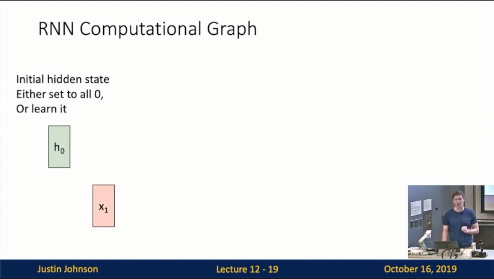
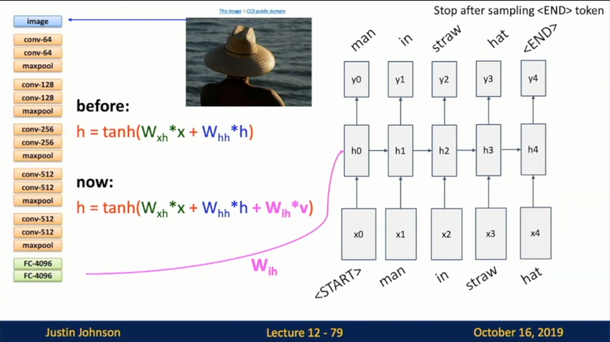
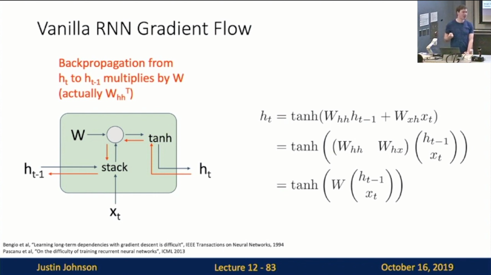
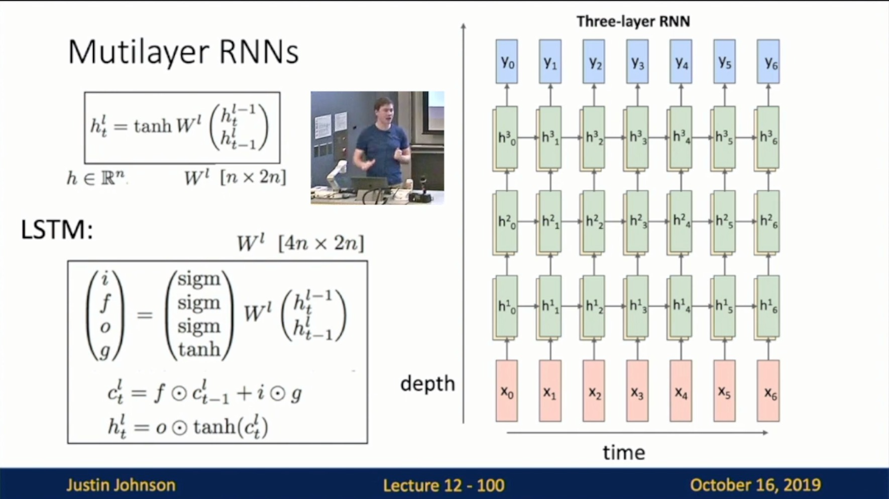

Michigan Online  
Deep Learning for Computer Vision  
Instructor: Justin Johnson  

Lecture 12: Recurrent Neural Networks

**Definition**
- So far: “Feedforward” Neural Networks
    - One-to-one 
        - e.g. Image classification (Image —> label)
- Recurrent Neural Networks: Process Sequences
    - One-to-many 
        - e.g. Image captioning (Image —> Sequence of words)
    - Many-to-one 
        - e.g. Video classification (Sequence of images —> label)
    - Many-to-many 
        - e.g. Machine translation (Sequence of words —> sequence of words)
        - e.g. Per-frame video classification (Sequence of images —> Sequence of labels)
- Sequential Processing of Non-Sequential Data
    - Examples
        - Classify images by taking a series of “glimpses”
        - Generate images one piece at a time
        - Integrate with oil paint simulator - at each tilmestep output a new stroke
- Key idea
    - RNNs have an “internal state” that is updated as a sequence is processed
    - We can process a sequence of vectors **x** by applying a **recurrence formula** at every time step:
        - Slide 12-17
        - Notice: the same function and the same set of parameters are used at every time step
     

** (Vanilla) RNN**
- Concept
    - Slide 12-18
    - Uses tanh
 

- RNN Computational Graph
    - Slide 12-19: Initial hidden state
        - Either set to all 0, or learn it
     
    
    - Slide 12-20, 12-21, 12-22
     
     
     
    
    - Slide 12-23: Re-use the same weight matrix at every time-step 
     
- RNN Computational Graph (Many to Many)
    - Slide 12-26
        - L: Loss function
 

- RNN Computational Graph (Many to One)
    - Slide 12-27
 

- RNN Computational Graph (One to Many)
    - Slide 12-28
 

- Sequence to Sequence (seq2seq): (Many to one) + (One to many): Slide 12-30
    - **Many to one**: Encode input sequence in a single vector
    - **One to many**: Produce output sequence from single input vector
    - JJ: different weight matrices for encoders and decoders
 

- Example: Language Modeling
    - Given characters 1, 2, …, t, model predicts character t
        - Slide 12-33. 12-37
     
     
    
    - At test-time, **generate** new text: sample characters one at a time, feed back to model
        - JJ: ‘sampling’
        - Slide 12-38, 12-39, 12-40, 12-41
     
     
     
     
    
    - So far: encode inputs as **one-hot-vector**: Slide 12-42, 12-43
        - Matrix multiply with a one-hot vector just extracts a column from the weight matrix. Often extract this into a separate **embedding** layer
     
     
    
- Backpropagation Through Time: Slide 12-45
    - Forward through entire sequence to compute loss, then backward through entire sequence to compute gradient
        - Problem: Takes a lot of memory for long sequences
     
    
- Truncated Backpropagation Through Time
    - Slide 12-46: Run forward and backward through chunks of the sequence instead of whole sequence
     
    
    - Slide 12-47: Carry hidden states forward in time forever, but only back propagate for some smaller number of steps
     
    
    - Slide 12-48
     
    
    - Example: min-char-rnn.py: 122 lines of Python
- Example: William Shakespeare
    - Slide 12-54
    - JJ: Given the previous 100 characters, predict the next character
     
- Searching for Interpretable Hidden Units
- Example: Image Captioning
    - Slide 12-71: CNN + RNN
     
    
    - Steps
        - Slide 12-72
         
        
        - Slide 12-73
         
        
        - Slide 12-74
         
        
        - Slide 12-75
         
        
        - Slide 12-76
         
        
        - Slide 12-77
         
        
        - Slide 12-78
         
        
        - Slide 12-79
         
        
- Vanilla RNN Gradient Flow
    - Slide 12-83
        - JJ: Problem with tanh
     
    
    - 2 Problems
        - **Gradient Clipping**: Slide 12-86
            - JJ: Kind of horrible dirty hack
        
       
       - **Change RNN architecture!**: Slide 12-87
        

**Long Short Term Memory (LSTM)**
- Intuition
    - Slide 12-90: Two vectors at each timestep
        - Cell state
        - Hidden state
     
    
    - Slide 12-91: Compute four **gates** at each tilmestep
     
- Architecture: Slide 12-92
    - i: Input gate, whether to write cell
    - f: Forget gate, whether to erase cell
    - o: Output gate, how much to reveal cell
    - g: Gate gate (?), how much to write to cell
 

- Gradient Flow
    - Slide 12-94
     
    
    - Slide 12-97
        - Uninterrupted gradient flow
        - Similar to ResNet
        - In between: Highway Networks
     

**Multi-layer RNN**
- Concept
    - So far: Single-Layer RNNs
    - Two-layer RNN: Slide 12-99
        - Pass hidden states from one RNN as inputs to another RNN
     
    
    - Three-layer RNN: Slide 12-100
     
    
    - JJ: Not commonly used

**Other RNN Variants**
- Slide 12-101
    - Gated Recurrent Unit (GRU)
    - 10,000 architectures with evolutionary search
    - JJ: Nothing really works better than LSTM
 

- Slide 12-102
    - Learned Architecture
 

**Summary**
- RNNs allow a lot of flexibility in architecture design
- Vanilla RNNs are simple but don’t work very well
- Common to use LSTM or GRU: additive interactions improve gradient flow
- Backward flow of gradients in RNN can explode or vanish
    - Exploding is controlled with gradient clipping
    - Vanishing is controlled with additive interactions (LSTM)
- Better/simpler architectures are a hot topic of current research
- Better understanding (both theoretical and empirical) is needed
