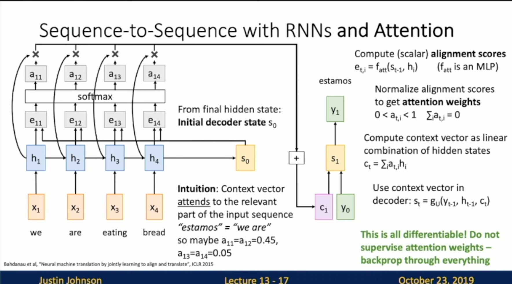

Michigan Online  
Deep Learning for Computer Vision  
Instructor: Justin Johnson  

Lecture 13: Attention

**Attention**
- Architecture
    - Sequence-to-Sequence with RNNs
        - Slide 13-5
            - Input: Sequence x_1, …, x_T
            - Output: Sequence y_1, …, y_T
            - Encoder: h_t = f_w(x_t, h_t-1)
         
        
        - Slide 13-6
            - From final hidden state predict: 
                - **initial decoder state** s_0
                - **Context vector** c (often c=h_T)
         
        
        - Slide 13-9
            - **Decoder**: s_t = g_U(y_t-1, h_t-1, c)
         
        
        - Slide 13-11
            - Problem: Input sequence bottlenecked through fixed-sized vector. What if T=1000?
            - Idea: use new content vector at each step of decoder!
         
        
    - Sequence-to-Sequence with RNNs and Attention
        - Slide 13-12
            - JJ: Encoder looks exactly the same
         
        
        - Slide 13-13
            - Compute (scaler) alignment scores
            - JJ: Alignment function. Fully-connected network. How much should we attend the encoder given the current state of the decoder
         
        
        - Slide 13-14
            - Normalize alignment scores to get **attention weights**
            - JJ: probability score
         
        
        - Slide 13-15
            - Compute context vector as linear combination of hidden states
         
        
        - Slide 13-16
            - This is all differentiable! Do not supervise attention weights - backprop through everything
         
        
        - Slide 13-17
            - Intuition: Context vector attends to the relevant part of the input sequence
         
        
        - Slide 13-18
            - Repeat: Use s_1 to compute new context vector c_2
         
        
        - Slide 13-20
         
        
        - Slide 13-21
            - Use a different context vector in each tilmestep of decoder
                - Input sequence not bottlenecked through single vector
                - At each tilmestep of decoder, context vector “looks at” different parts of the input sequence
         
        
        - Slide 13-26
            - JJ: Something we can notice is, this mechanism we built does not care the input we have is a sequence
         
        
- Examples
    - Image Captioning with RNNs and Attention
        - Slide 13-27
         
        
        - Slide 13-28
         
        
        - Slide 13-29
         
        
        - Slide 13-30
         
        
        - Slide 13-31
         
        
        - Slide 13-32
         
        
        - Slide 13-33
         
        
        - Slide 13-34
         
        
        - Slide 13-35
         
        
        - Slide 13-36
         
        
        - Slide 13-37
         
        
        - JJ: The structure of the model looks very similar to our seq2seq model
- Paper
    - Slide 13-45: X, Attend, and Y
 

**Self-Attention**
- Attention Layer
    - JJ: Generalize from the idea of attention
    - Changes
        - Use dot product for similarity
            - Slide 13-46
             
            
            - Slide 13-47
             
            
            - Slide 13-48
             
            
            - Slide 13-49
             
            
        - Multiple **query** vectors
            - Slide 13-50
             
        
        - Separate **key** and **value**
            - JJ: we do this to use input vectors twice. Give model more flexibility
            - Slide 13-51
             
            
            - Slide 13-57
             
            
- Special case: Self-Attention Layer
    - One query per input vector: Slide 13-65
     
    
    - Consider permuting the input vectors
        - Slide 13-67: Queries and Keys will be the same, but permuted
         
        
        - Slide 13-68: Similarities will be the same, but permuted
         
        
        - Slide 13-69: Attention weights will be the same, but permuted
         
        
        - Slide 13-70: Values will be the same, but permuted 
         
        
        - Slide 13-71: Outputs will be the same, but permuted
         
        
        - Slide 13-72
            - Self-attention layer is **Permutation Equivariant** f(s(x)) = s(f(x))
            - Self-attention layer works on sets of vectors
         
        
        - Slide 13-73: Self attention doesn’t “know” the order of vectors it is processing!
         
        
        - Slide 13-74
            - In order to make processing position-aware, concatenate input with **positional encoding**
            - E can be learned lookup table, or fixed function
         
        
- Masked Self-Attention Layer
    - Slide 13-76: Intuition
        - Don’t let vector “look ahead” in the sequence 
        - Used for language modeling (predict next word)
     
- Multihead Self-Attention Layer
    - Slide 13-77
        - JJ: Actually used in practice commonly
     
- Example: CNN with Self-Attention
    - Slide 13-78
     
    
    - Slide 13-79
     
    
    - Slide 13-80
     
    
    - Slide 13-81
     
    
    - Slide 13-82
     
    
    - Slide 13-83
     

**Transformer**
- Three Ways of Processing Sequences: Slide 13-86
    - Recurrent Neural Networks
        - Works on Ordered Sequences
            - Good at long sequences
            - Not parallelizable
    - 1D Convolution
        - Works on Multidimensional Grids
            - Bad at long sequences
            - Highly parallel
    - Self-Attention
        - Works on Sets of Vectors
            - Good at long sequences
            - Highly parallel
            - Very memory intensive
    - Famous paper: Attention is all you need
 

- The Transformer
    - Steps
        - Slide 13-88
         
        
        - Slide 13-89: Self-Attention
         
        
        - Slide 13-90: Residual connection
         
        
        - Slide 13-91: Layer Normalization
         
        
        - Slide 13-92: MLP independently on each vector
         
        
        - Slide 13-93: Residual connection
         
        
        - Slide 13-94 Layer Normalization
         

    - Slide 13-95: Transformer Block
        - Input: Set of vectors x
        - Output: Set of vectors y
        - Self-attention is the only interaction b/w vectors!
        - Layer norm and MLP work independently per vector
        - Highly scalable, highly parallelizable
     
    
    - Slide 13-96: Transformer
        - A **Transformer** is a sequence of transformer blocks
     
    
    - Slide 13-97: Transfer Learning
        - “ImageNet Moment for NLP”
        - Pretraining
            - Download a lot of text from the internet
            - Train a giant Transformer model for language modeling
        - Finetuning
            - Fine-tune the Transformer on your own NLP task
     
    
    - Slide 13-102: Scaling up Transformers
        - JJ: As the model gets bigger, the better you train
     

**Summary**
- Adding **Attention** to RNN models lets them look at different parts of the input at each tilmestep
- Generalized **Self-Attention** is new, powerful neural network primitive
- **Transformers** are a new neural network model that only uses attention

