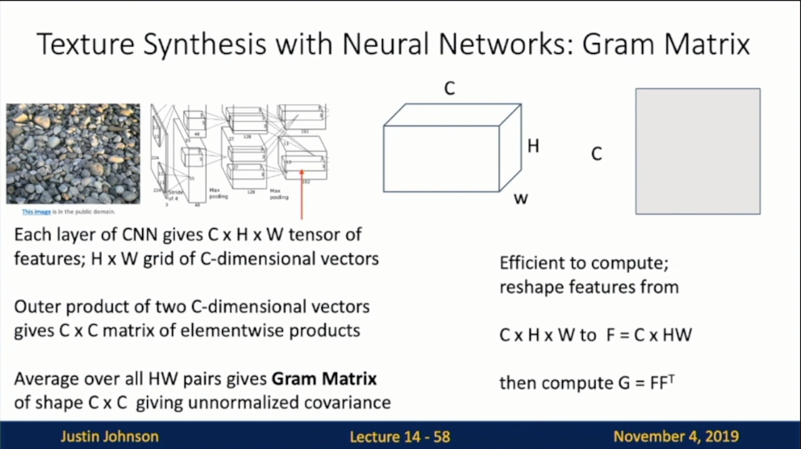

Michigan Online  
Deep Learning for Computer Vision  
Instructor: Justin Johnson  

Lecture 14: Visualizing and Understanding

**Activations**
- First Layers: Visualize Filters
- Higher Layers: Visualize Filters
    - We can visualize filters at higher layers, but not that interesting
- Last Layer
    - Nearest Neighbors
        - L2 Nearest neighbors in feature space
    - Dimensionality Reduction
        - Visualize the “space” of FC7 feature vectors by reducing dimensionality of vectors from 4096 to 2 dimensions
        - Simple algorithm: PCA
        - More complex: t-SNE
- Visualizing Activations
- Maximally Activating Patches
    - Pick a layer and a channel; e.g. conv5 is 128 * 13 * 13, pick channel 17/128
    - Run many images through the network, record values of chosen channel
    - Visualize image patches that correspond to maximal activations
- Saliency via Occlusion: Slide 14-15
    - Mask part of the image before feeding to CNN, check how much predicted probabilities change
     
- Saliency via Backprop: Slide 14-17
    - Forward pass: Compute probabilities
    - Compute gradient of (unnormalized) class score with respect to image pixels, take absolute value and max over RGB channels
    - JJ: Check the network is looking at the right part of the image
     

**Graidents**
- Saliency Maps: Segmentation without Supervision
    - Use GrabCut on saliency map
- Intermediate Features via (guided) backprop
    - JJ: Use gradient info to pick out pixels
    - Slide 14-21
        - Pick a single intermediate neuron, e.g. one value in 128 * 13 * 13 conv5 feature map
        - Compute gradient of neuron value with respect to image pixels
        - Images come out nicer if you only backprop positive gradients through each ReLU (guided backprop)
     
    
    - Slide 14-22
     
- Gradient Ascent
    - Slide 14-24
        - **(Guided) backprop**: Find the part of an image that a neuron responds to
        - **Gradient ascent**: Generate a synthetic image that maximally activates a neuron
     
    
    - Step 1: Slide 14-25
     
    
    - Simple Regularizer: Slide 14-27
     
    
    - Better Regularizer: Slide 14-30
     
- Adversarial Examples
    - 1. Start from an arbitrary image
    - 2. Pick an arbitrary category
    - 3. Modify the image (via gradient ascent) to maximize the class score
    - 4. Stop when the network is fooled
    - Slide 14-37
     
- Feature Inversion
    - Slide 14-38
        - Given a CNN feature vector for an image, find a new image that
            - Matches the given feature vector
            - “Looks natural” (image prior regularization)
     
    
    - Slide 14-39
        - Reconstructing from different layers of VGG-16
     

**Fun**
- DeepDream: Amplify Existing Features
    - Slide 14-40
     
    
    - Slide 14-45: Code
     
    
    - Slide 14-47: Lower level layer (looking for edges)
     
    
    - Slide 14-48: Higher level layer 
     
    
- Texture Synthesis 
    - Given a sample patch of some texture, can we generate a bigger image of the same texture?
    - Nearest Neighbor
    - Texture Synthesis w/ Neural Networks: Gram Matrix
        - Slide 14-55
         
        
        - Slide 14-56
         
        
        - Slide 14-57
         
        
        - Slide 14-58
         
    - Neural Texture Synthesis
        - Slide 14-65
         
    - Neural Style Transfer: Feature + Gram Reconstruction
        - Slide 14-68
         
        
        - Slide 14-69
         
        
        - Slide 14-70
         
        
        - Problem: Style transfer requires many forward / backward passes through VGG; very slow!
            - JJ: Takes a lot of GPUS
        - Solution: Train another neural network to perform style transfer for us!
            - Fast Neural Style Transfer
            - Instance Normalization: Slide 14-88
             

**Summary**
- Many methods for understanding CNN representations
    - **Activations**: Nearest neighbors, Dimensionality reduction, mammal patches, occlusion
    - **Gradients**: Saliency maps, class visualization, fooling images, feature inversion
    - **Fun**: DeepDream, Style Transfer

