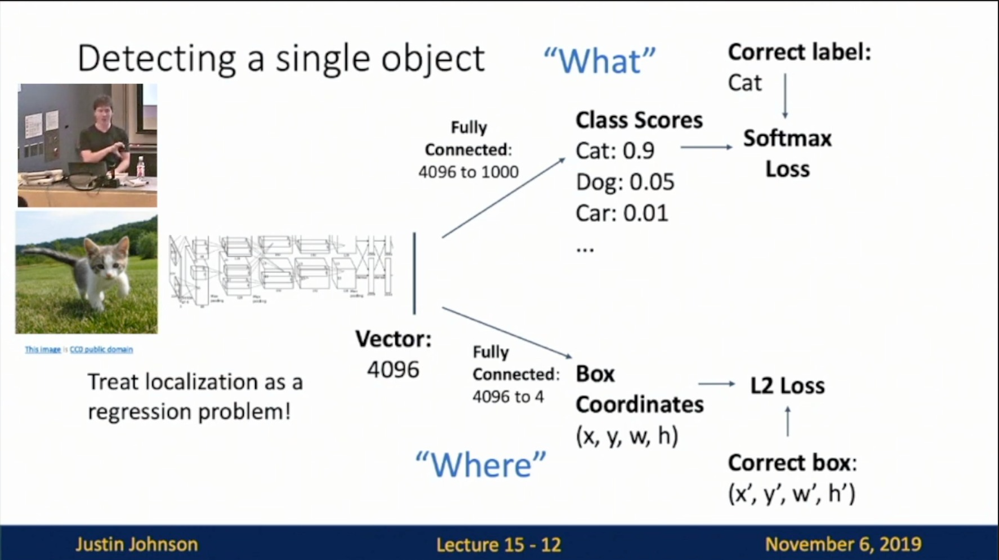

Michigan Online  
Deep Learning for Computer Vision  
Instructor: Justin Johnson  

Lecture 15: Object Detection

**Overview**
- So far: Image Classification
    - JJ: Image in, label out
- Computer Vision Tasks: Slide 15-6
    - Classification
    - Semantic Segmentation
    - Object Detection (Today)
    - Instance Segmentation

**Object Detection**
- Task Definition: Slide 15-8
    - Input: Single RGB Image
    - Output: A set of detected objects; For each object predict:
        - 1. Category label (from fixed, known set of categories)
        - 2. Bounding box (four numbers: x, y, width, height)
 

- Challenges
    - **Multiple outputs**: Need to output variable numbers of objects per image
    - **Multiple types of output**: Need to predict “what“ (category label) as well as “where” (bounding box)
    - **Large images**: Classification works at 224 * 224; need higher resolution for detection, often ~800 * 600
        - JJ: It’s a computation issue. Needs fewer images per batch. Train longer. Multi-distributed training…
        - JJ: No.2 core CV problem after image classification
- Detecting a single object
    - Steps
        - Slide 15-10: Get Vector representation 
         
        
        - Slide 15-11: “What”
         
        
        - Slide 15-12: “Where”
            - Treat localization as a regression problem!
         
        
        - Slide 15-14: Multitask Loss
            - Add up losses to make one loss function
         
        
        - Slide 15-15: Often pretrained on ImageNet (Transfer learning)
         
    - Problem: Images can have more than one object!
- Detecting Multiple Objects
    - Slide 15-17: Need different numbers of outputs per image
     
    
    - Sliding Window
        - Slide 15-19
            - Apply a CNN to many different crops of the image, CNN classifies each crop as object or background
         
        
        - Challenge: Slide 15-25
            - Problem: How many possible boxes are there in an image of size H * W
         

**R-CNN: Region-Based CNN**
- Region Proposals: Slide 15-26
    - Find a small set of boxes that are likely to cover all objects
    - Often based on heuristics: e.g. look for “blob-like” image regions
    - Relatively fast to run e.g. Selective Search
 

- Steps
    - Slide 15-27: Region Proposal
     
    
    - Slide 15-28
     
    
    - Slide 15-29: Warp
     
    
    - Slide 15-30
     
    
    - Slide 15-31
     
    
    - Slide 15-32: Bounding box regression
     
    
    - Slide 15-33
     
    
- Test-time: Slide 15-34
    - Input Single RGB Image
    - 1. Run region proposal method to compute ~2000 region proposals
    - 2. Resize each region to 224 * 224 and run independently through CNN to predict class scores and box transform
    - 3. Use scores to select a subset of region proposals to output
    - 4. Compare with ground-truth boxes
    - Comments:
        - JJ: we do not use location info as input
        - JJ: in classification, we usually use 224 * 224, then we warp the image to 224 * 224 for image detection as well
 

- Comparing Boxes: Intersection over Union (IoU)
    - Slide 15-37
        - Intersection over Union (IoU) (Also called “Jaccard similarity” or “Jaccard index”)
        - Area of Intersection / Area of Union
            - IoU > 0.5 is “decent”
            - IoU > 0.7 is “pretty good”
            - IoU > 0.9 is “almost perfect”
     
- Overlapping Boxes: Non-Max Suppression (NMS)
    - Slide 15-41
        - Problem: Object detectors often output many overlapping detections:
        - Solution: Post-process raw detections using Non-Max Suppression (NMS)
            - 1. Select next highest-scoring box
            - 2. Eliminate lower-scoring boxes with IoU > threshold (e.g. 0.7)
            - 3. If any boxes remain, GOTO 1
        - Example: Slide 15-42, 15-43, 15-44
     
    
    - Failure mode: Slide 15-45
        - JJ: Still ongoing challenge
     
- Evaluating Object Detectors: Mean Average Precision (mAP)
    - 1. Run object detector on all test images (with NMS)
    - 2. For each category, compute Average Precision (AP) = area under Precision vs Recall Curve
        - Steps: 
            - 1. Slide 15-47
             
            
            - 1-1 & 2. Slide 15-48
               
                
            - 1-3. Slide 15-49, 15-50, 15-51, 15-52, 15-53
             
             
             
             
             
                
            - 2. Slide 15-54 
             
    - How to get AP = 1.0: Slide 15-55
        - JJ: All TPs come before All FPs
        - JJ: Why this metric? Trade-off b/w how many objets you hit and how many objects you miss
     
    
    - 3. Mean Average Precision (mAP) = average of AP for each category
        - Slide 15-56
     
    
    - 4. For “COCO mAP”: Compute mAP&thresh for each IoU threshold (0.5, 0.55, 0.6, …, 0.95) and take average
        - Slide 15-57
     
    
- Problems with R-CNN
    - Problem: Very slow! Need to do ~2k forward passes for each image!
    - Solution: Run CNN *before* warping!

**Fast R-CNN**
- Steps
    - Slide 15-62
     
    
    - Slide 15-63: Run whole image thru ConvNet
        - JJ: Most computation
     
    
    - Slide 15-64: RoIs from a proposal method
     
    
    - Slide 15-65: Crop + Resize features
     
    
    - Slide 15-66: Per-Region Network
     
    
    - Slide 15-67: Category and box transform per region
     
    
- Structure
    - Slide 15-68
        - Per-Region network is relatively lightweight
        - Most of the computation happens in backbone network; this saves work for overlapping region proposals
     
    
- Examples
    - AlexNet: Slide 15-69
     
    
    - ResNet: Slide 15-70
     
    
- How to crop features?
- Cropping Features
    - RoI Pool
        - Project proposal onto features: Slide 15-74
         
        
        - “Snap” to grid cells: Slide 15-75
         
        
        - Divide into 2 * 2 grid of (roughly) equal subregions: Slide 15-76
         
        
        - Max-pool within each subregion: Slide 15-77
            - Region features always the same size even if input regions have different sizes!
         
        
        - Problem: Slight misalignment due to snapping, different-sized subregions is weird
    - RoI Align: Slide 15-89
     
    
- Fast R-CNN vs “Slow” R-CNN: 
    - Problem: Slide 15-93
     
    
    - Problem: Slide 15-94
     

**Faster R-CNN: Learnable Region Proposals**
- Slide 15-95
    - Insert **Region Proposal Network (RPN)** to predict proposals from features
    - Otherwise same as Fast R-CNN: Crop features for each proposal, classify each one
 

- Region Proposal Network (RPN)
    - Steps
        - Slide 15-96: Run backbone CNN
         
        
        - Slide 15-97: Anchor box
         
        
        - Slide 15-98: Binary classification
         
        
        - Slide 15-99: Also predict a box transform to regress from anchor box to object box
         
        
    - Challenge: Slide 15-100
        - Problem: Anchor box may have the wrong size / shape
        - Solution: Use K different anchor boxes at each point!
     
    
- Loss: Slide 15-101
    - Jointly train with 4 losses
        - 1. RPN classification
        - 2. RPN regression
        - 3. Object classification
        - 4. Object regression
 

- Comparison: Slide 15-102
 

- Faster R-CNN is a **Two-stage** object detector: Slide 15-103
    - Question: Do we really need the second stage?
 

- Single-Stage Object Detection: Slide 15-106
    - RPN: Classify each anchor as object / not object
    - Single-Stage Detector: Classify each object as one of C categories (or background)
    - Sometimes use **category-specific regression**: Predict different box transforms for each category
 

**Current Status & Code**
- Object Detection: Lots of variables!
    - Takeaways: Slide 15-110
        - Two stage method (Faster R-CNN) get the best accuracy, but are slower
        - Single-stage methods (SSD) are much faster, but don’t perform as well
        - Bigger backbones improve performance, but are slower
     
    
    - Since 2017: Slide 15-118
        - Train longer!
        - Multiscale backbone: Feature Pyramid Networks
        - Better backbone: ResNeXt
        - Single-Stage methods have improved
        - Very big models work better
        - Test-time augmentation pushes numbers up
        - Big ensembles, more data, etc
     
    
- Open-Source Code: Slide 15-119
    - Detectron2 (PyTorch)
    - Fast/Faster/Mask R-CNN, RetinaNet
 

**Summary**
- **”Slow” R-CNN**: Run CNN independently for each region
- **Fast R-CNN**: Apply differentiable cropping to shared image features
- **Faster R-CNN**: Compute proposal with CNN
- **Single-Stage**: Fully convolutional detector
