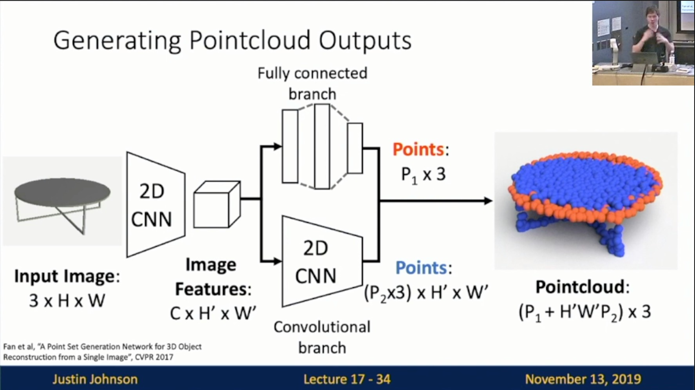
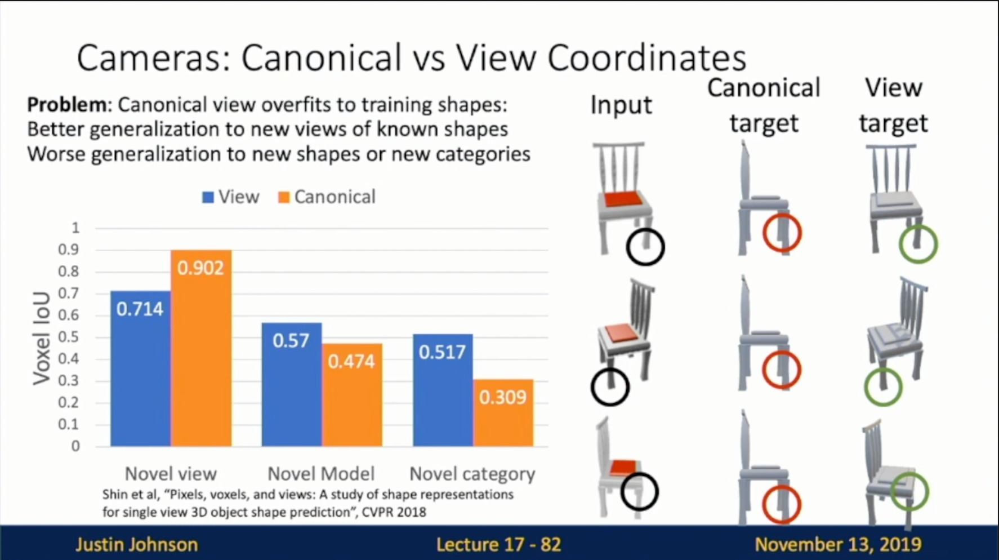

Michigan Online  
Deep Learning for Computer Vision  
Instructor: Justin Johnson  

Lecture 17: 3D Vision

**Overview**
- Focus on Two Problems today
    - Predicting 3D shapes from single image
        - Input: Image
        - Output: 3D shape
    - Processing 3D input data
        - Input: 3D shape
        - Output: label

**3D Shape Representations**
- 3D Shape Representations: Slide 17-8
    - Depth Map
    - Voxel Grid
    - Implicit Surface
    - Pointcloud
    - Mesh
 

- Depth Map
    - Depth Map
        - Definition: Slide 17-10
            - For each pixel, **depth map** gives distance from the camera to the object in the world at that pixel
            - RGB-D Image (2.5D)
        
        
        - Predicting Depth Maps: Slide 17-13
            - Per-Pixel Loss (Scale invariant)
        
        
        - Problem: Scale/Depth Ambiguity: Slide 17-12
        
        
    - Surface Normals
        - Definition: Slide 17-14
            - For each pixel, **surface normals** give a vector giving the normal vector to the object in the world for that pixel
        
        
        - Predicting Normals: Slide 17-15
        
        
- Voxel Grid
    - Definition: Slide 17-17
        - Good: Conceptually simple: just a 3D grid!
        - Bad: Need high spatial resolution to capture fine structures
        - Bad: Scaling to high resolutions is nontrivial!
        - JJ: A minecraft representation
    
    
    - Processing Voxel Inputs
        - 3D Convolution: Slide 17-18
            - JJ: Kernel does not to be binary, will be real-valued
    - Generating Voxel Shapes
        
        
        - 3D Convolution: Slide 17-19
            - JJ: This architecture is very very computationally expensive
        
        
        - “Voxel Tubes”: Slide 17-20
            - JJ: V * V * V called a voxel 2 representation
            - Q: Do we sacrifice anything by doing this?
            - JJ’s A: We sacrifice translational invariance in Z-dimension, but we still have translational invariance in XY-dimension
        
        
    - Voxel Problems: Memory Usage
        - Storing 1024^3 voxel grid takes 4GB of memory!
    - Scaling Voxels: 
        - Oct-Trees: Slide 17-22
            - JJ: Implementing this is tricky
        
        
        - Nested Shape Layers: Slide 17-23
            - Predict shape as a composition of positive and negative spaces
        
        
- Implicit Surface
    - Definition: Slide 17-27
        - Learn a function to classify arbitrary 3D points as inside/outside the shape
        - Signed distance function (SDF)
    
    
    - 3D Shape Representations
        - Implicit Functions: Slide 17-29
    
    
- Pointcloud
    - Definition: Slide 17-32
        - Good: Can represent fine structures without huge numbers of points
        - Neutral: Requires new architecture, losses, etc
        - Bad: Doesn’t explicitly represent the surface of the shape: extracting a mesh for rendering or other applications requires post-processing
            - JJ: we kinda need to inflate the point to ball-size (as shown in figures)
    
    
    - Processing Pointcloud Inputs
        - PointNet: Slide 17-33
            - Want to process pointclouds as **sets** order should not matter
    - Generating Pointcloud Outputs
        
        
        - Architecture: Slide 17-34
        
        
        - Loss Function
            - We need a (differentiable) way to compare point clouds as **sets**!
            - Chamfer distance: Slide 17-37, 17-39
            
            

- Mesh
    - Definition
        - Slide 17-42
            - Good: Standard representation for graphics
            - Good: Explicitly represents 3D shapes
        
        
        - Slide 17-43
            - Good: Adaptive: Can represent flat surfaces very efficiently, can allocate more faces to areas with fine detail
        
        
        - Slide 17-44
            - Can attach data on verts and interpolate over the whole surface: RGB colors, texture coordinates, normal vectors, etc
        
        
    - Predicting Triangle Meshes: Pixel2Mesh: Slide 17-47
        
        
        - Iterative Refinement: Slide 17-48
        
        
        - Graph Convolution: Slide 17-49, 17-51
        
        
        
        - Vertex Aligned-Features: Slide 17-52, 17-53
        
        
        
        - Chamfer Loss Function: Slide 17-55
            
            
            - Steps: Slide 17-56, 17-57, 17-60
            
            
            

**3D Metrics**
- Shape Comparison Metrics
    - Intersection over Union: Slide 17-68
    
    
    - Chamfer Distance: Slide 17-70
        - JJ: sensitive to outliers since it relies on L2 distance
    
    
    - F1 Score: Slide 17-74, 17-75
        - JJ: better loss
    
    

**3D Camera Systems**
- Cameras: Canonical vs View Coordinates
    - Definition: Slide 17-80
        - Canonical Coordinates
        - View Coordinates
        - JJ: a lot of people use view coordinates since it is easy to implement
    
    
    - Problem: Slide 17-81, 17-82
    
    
    
- View-Centric Voxel Predictions: Slide 17-84

**3D Datasets**
- Object-Centric: Slide 17-88
    - ShapeNet
        - JJ: not a realistic dataset
    - Pix3D
        - JJ: real images!

**3D Shape Prediction**
- Mesh R-CNN
    - Task: Slide 17-90
    
    
    - Hybrid 3D shape representation: Slide 17-92
        - Mesh deformation
        - Our approach
    
    
    - Pipeline: Slide 17-96
    
    
    - Results: Slide 17-97
    
    
    - Shape Regularizers: Slide 17-98
    
