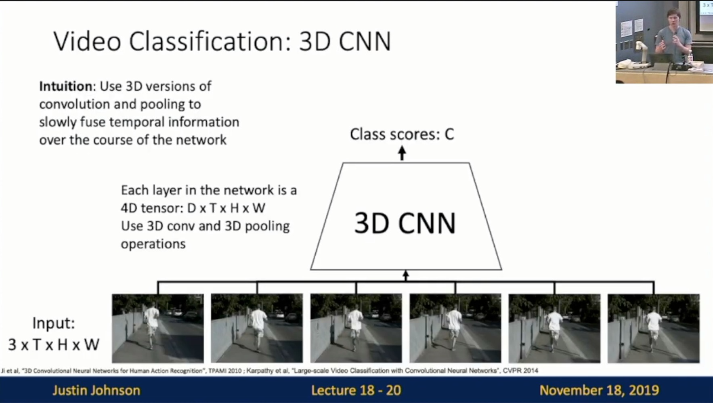
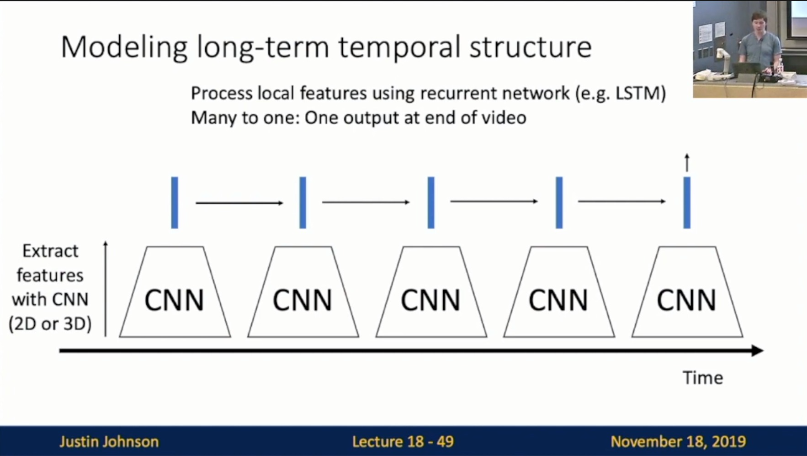

Michigan Online  
Deep Learning for Computer Vision  
Instructor: Justin Johnson  

Lecture 18: Videos

**Overview**
- Video = 2D+Time: Slide 18-6
    - A video is a **sequence** of images
        - 4D tensor: T * 3 * H * W
 

- Video Classification
    - Images: Recognize **objects**
    - Videos: Recognize **actions**
        - e.g. Swimming/Running/Jumping
- Problems: Videos are big!: Slide 18-10
    - Videos are ~30 frames per second (fps)
    - Size of uncompressed video (3 bytes per pixel):
        - SD (640 * 480): ~1.5 GB per minute
        - HD (1920 * 1080): ~10 GB per minute
    - Solution: Train on short **clips**: low fps and low spatial resolution
        - e.g. T=16, H=W=112 (3.2 seconds at 5 fps, 588 KB)
 

- Training on Clips: Slide 18-13
    - **Raw video**: Long, high FPS
    - **Training**: Train model to classify short clips with low FPS
    - **Testing**: Run model on different clips, average predictions
 

**Video Classification Models**
- Single-Frame CNN: Slide 18-14
    - Simple idea: train normal 2D CNN to classify video frames independently! (Average predicted probs at test-time)
    - Often a **very**strong baseline for video classification
    - JJ: you should not discount this. Always try this first
 

- Late Fusion 
    - Intuition: Get high-level appearance of each frame, and combine them
    - JJ: Called late fusion since we introduce temporal info very late
    - with FC layers: Slide 18-15
        - Run 2D CNN on each frame, concatenate features and feed to MLP
     
    
    - With pooling: Slide 18-16
        - Run 2D CNN on each frame, pool features and feed to Linear
     
    
    - Problem: Hard to compare low-level motion between frames
- Early Fusion: Slide 18-18
    - Intuition: Compare frames with very first conv layer, after that normal 2D CNN
    - Reshape input size from T * 3 * H * W to 3T * H * W
    - First 2D convolution collapses all temporal information
        - Input: 3T * H * W
        - Output: D * H * W
    - Rest of the network is standard 2D CNN
    - Problem: One layer of temporal processing may not be enough!
 

- 3D CNN: Slide 18-20
    - Intuition: Use 3D versions of convolution and pooling to slowly fuse temporal info over the course of the network
    - Input: 3 * T * H * W
    - Each layer in the network is a 4D tensor: D * T * H * W
    - Use 3D conv and 3D pooling operations
    - JJ: Also called “slow fusion”
 

- Early Fusion vs Late Fusion vs 3D CNN: Slide 18-27
    - (Small example architectures in practice much bigger)
    - Late Fusion
        - Build slowly in space, all-at-once in time at end
    - Early Fusion
        - Build slowly in space, all-at-once in time at start
    - 3D CNN
        - Build slowly in space, build slowly in time 
        - “Slow Fusion”
     
    
    - 2D Conv (Early Fusion) vs 3D Conv (3D CNN)
        - 2D Conv (Early Fusion): Slide 18-30
            - No temporal shift-invariance! Needs to learn separate filters for the same motion at different times in the clip
         
        
        - 3D Conv (3D CNN): Slide 18-32
            - Temporal shift-invariant since each filter slides over time!
            - Can visualize as video clips!: Slide 18-33
         
        
    - Example Video Dataset: Sports-1M
        - 1 million YouTube videos annotated with labels for 487 different types of sports
- C3D: The VGG of 3D CNNs: Slide 18-37
    - 3D CNN that uses all 3 * 3 * 3 conv and 2 * 2 * 2 pooling (except Pool1 which is 1 * 2 * 2)
    - Released model pertained on Sports-1M: Many people used this as a video feature extractor
    - Problem: 3 * 3 * 3 conv is very expensive!
        - JJ: Even though the input is tiny
 

- Two-stream networks
    - Recognizing Actions from Motion
        - We can easily recognize actions using only **motion information**
        - Measuring Motion: Optical Flow: Slide 18-42
            - Optical Flow highlights **local motion**
         
        
    - Separating Motion and Appearance: Two-Stream Networks: Slide 18-43
        - Spatial stream ConvNet
        - Temporal stream ConvNet
            - Input: Stack of optical flow
     
    
- CNN + RNN
    - Modeling long-term temporal structure
        - Many to one: Slide 18-49
         
        
        - Many to many: Slide 18-50
         
        
        - Sometimes don’t back prop to CNN to save memory; retrain and use it as a feature extractor
- Recurrent Convolutional Network
    - Slide 18-57
     
    
    - Slide 18-59
     
    
    - Slide 18-60
     
    
    - Slide 18-61
     
    
    - Comparison: Slide 18-62
     
    
    - Problem: RNNs are slow for long sequences (can’t be parallelized)
        - JJ: So people don’t use it in practice
- Spatio-Temporal Self-Attention (Nonlocal Block)
    - Recall: Slide 18-66
     
    
    - Architecture: 
        - Slide 18-74
         
        
        - Slide 18-75
         
        
    - Inflating 2D Networks to 3D: 
        - Idea: take a 2D CNN architecture
        - Replace each 2D conv/pool layer with a 3D version
        - Inception Block: Original: Slide 18-77 
         
        
        - Inception Block: Inflated: Slide 18-78
         
        
        - Can use weights of 2D conv to initialize 3D conv: Slide 18-79
         
        
        - Comparison: Slide 18-80
         
        
- Treating time and space differently: SlowFast Networks
    - JJ: Current state-of-the-art
    - Architecture: Slide 18-86
        - Slow
        - Fast
     
    
    - Details: Slide 18-88
     

**Other Studies**
- Temporal Action Localization: Slide 18-90
    - Given a long untrimmed video sequence, identify frames corresponding to the different actions
    - Can use architecture similar to Faster R-CNN: first generate temporal proposal and then classify
 

- Spatio-Temporal Detection: Slide 18-91
    - Given a long untrimmed video, detect all the people in space and time and classify the activities they are performing 
 
