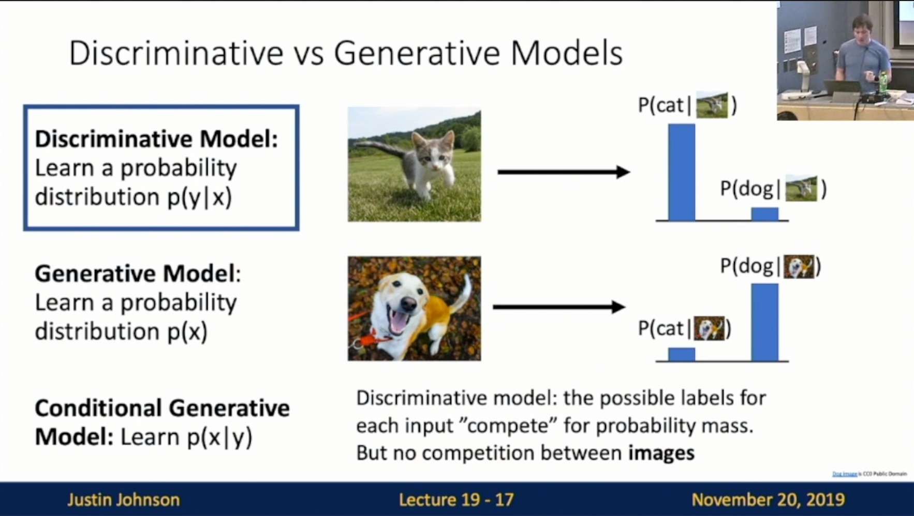

Michigan Online  
Deep Learning for Computer Vision  
Instructor: Justin Johnson  

Lecture 19: Generative Models I

**Overview**
- Supervised vs Unsupervised Learning
    - Supervised Learning
        - Data: (x, y)
            - X is data, y is label
        - Goal: Learn a function to map x -> y
        - Examples: Classification, regression, object detection, semantic segmentation, image captioning, etc.
    - Unsupervised Learning
        - Data: x
            - Just data, no labels!
        - Goal: Learn some underlying hidden structure of the data
        - Examples: Clustering, dimensionality reduction, feature learning, density estimation, etc
- Discriminative vs Generative Models
    - Probability Recap p(x) assigns a positive number to each possible x; higher numbers mean x is more likely: Slide 19-15
        - Density functions are normalized
    - Discriminative Model: Learn a probability distribution p(y|x)
        - Slide 19-17: The possible labels for each input “compete” for probability mass. But no competition b/w images
         
        
        - Slide 19-19: No way for the model to handle unreasonable inputs; it must give label distributions for all images
         
        
   - Generative Model: Learn a probability distribution p(x)
        - Slide 19-21: All possible images compete with each other for probability mass
            - Requires deep image understanding!
            - Model can “reject” unreasonable inputs by assigning them small values
        - JJ: Great question (How can we tell how good is a generative model). Extremely challenging. One of the mechanisms is the idea of perplexity. If it did a good job of learning the underlying visual structure of the world, then it should assign relatively high probability density to unseen test images if those images are not seen in the training time.
         
        
    - Conditional Generative Model: Learn p(x|y)
        - Slide 19-23: Each possible label induces a competition among all images.
            - JJ: See the abstract image on the right
         
        
    - Recall Baye’s Rule: 19-25
        - JJ: Goal is to learn unconditional generative model, then we an get conditional generative model combined with discriminative model we have
     
    
    - What can we do with a generative model?
        - Slide 19-28
         
        
- Taxonomy of Generative Models: Slide 19-34
    - Explicit density: Model can compute p(x)
        - Tractable density: Can compute p(x)
            - Autoregressive
            - NADE/MADE
            - NICE/REALNVP
            - Glow
            - Ffjord
        - Approximate density: Can compute approximation to p(x)
            - Variational: Variational Autoencoder
            - Markov Chain: Boltzmann Machine
    - Implicit density: Model does not explicitly compute p(x), but can sample from p(x)
        - Markov Chain: GSN
        - Direct: Generative Adversarial Networks (GANs)
 

**Autoregressive Models**
- Explicit Density Estimation: 
    - Goal: Write down an explicit function for p(x) = f(x, W)
    - General form: Slide 19-39
     
    
    - Autoregressive Models: Slide 19-43
        - Language modeling with an RNN!
     
    
- PixelRNN: Slide 19-51
    - Generate image pixels one at a time, starting at the upper left corner
    - Compute a hidden state for each pixel that depends on hidden sates and RGB values from the left and from above (LSTM recurrence)
    - At each pixel, predict red, then, blue, then green: softmax over[0, 1, …, 255]
    - Each pixel depends **implicity** on all pixels above and to the left
    - Problem: Very slow during both training and testing; N * N image requires 2N-1 sequential steps
 

- PixelCNN: Slide 19-56
    - Still generate image pixels starting from corner
    - Dependency on previous pixels now modeled using a CNN over context region
    - Training: maximize likelihood of training images
    - Training is faster than PixelRNN
    - Problem: Generation must still proceed sequentially -> still slow
 

- Summary of Autoregressive Models: Slide 19-58
    - Pros
        - Can explicitly compute likelihood p(x)
        - Explicit likelihood of training data gives good evaluation metric
        - Good samples
    - Cons
        - Sequential generation -> slow
 

**Variational Autoencoders**
- Intuition: Slide 19-60
    - VAE define an **intractable density** that we cannot explicitly compute or optimize
    - But we will be able to directly optimize a **lower bound** on the density
 

- Term “Autoencoders” 
    - (Regular, non-variational) Autoencoders
        - Slide 19-62
            - Unsupervised method for learning feature vectors from raw data x, without any labels
            - Features should extract useful info that we can use for downstream tasks
         
        
        - Slide 19-64
            - Problem: How can we learn this feature transform from raw data?
            - Idea: Use the features to reconstruct the input data with a **decoder**
                - “Autoencoding” = encoding itself
         
        
        - Slide 19-67
            - Loss: L2 distance b/w input and reconstructed data
            - Features need to be **lower dimensional** than the data
         
        
        - Slide 19-69
            - After training, **throw away decoder** and use encoder for a downstream task
            - Encoder can be used to initialize a **supervised** model
         
        
        - Slide 19-70
            - Autoencoders learn **latent features** for data w/o any labels!
            - Can use features to initialize a **supervised** model
            - Problem: Not probabilistic. No way to sample new data from learned model
         

- Term “Variational”
    - Probabilistic spin on autoencoders:
        - 1. Learn latent features z from raw data
        - 2. Sample from the model to generate new data
    - Intuition: x is an image, z is latent factors used to generate x: attributes, orientation, etc.
    - First Half: Slide 19-75
        - Assume simple prior p(z), e.g. Gaussian
     
    
    - Second Half: Slide 19-76
        - Represent p(x|z) with a neural network (Similar to **decoder** from autoencoder)
     
    
    - Decoder must be **probabilistic**: Slide 19-77
     
    
    - How to train this model?: 
        - Basic idea: **maximize likelihood of data**: Slide 19-78
         
        
        - If we could observe the z for each x, then could train a conditional generative model p(x|z)
        - Marginalize: Slide 19-82
            - Problem
         
        
        - Another idea: Try Baye’s Rule: 
            - Problem: Slide 19-86
             
            
            - Solution: Slide 19-87
             
            
            - Slide 19-88
             
            
- Structure: Slide 19-89
    - **Idea**: Jointly train both encoder and decoder
    - **Decoder network** inputs latent code z, gives distribution over data x
    - **Encoder network** inputs data x, gives distribution over latent codes z
     
    
    - Maths (3 terms)
        - Data Reconstruction: Slide 19-96
         
        
        - KL divergence b/w prior and samples from encoder network: Slide 19-97
         
        
        - KL divergence b/w encoder and posterior of decoder: Slide 19-98
         
        
        - KL is >= 0, so dropping this term gives a **lower bound** on the data likelihood: Slide 19-99
         
        
        - Slide 19-100
         
        
    - Slide 19-101
        - Jointly train **encoder** q and **decoder** p to maximize the **variational lower bound** on the data likelihood
     
