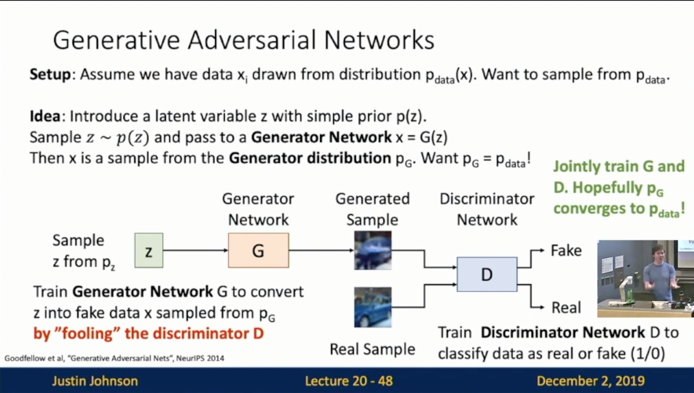

Michigan Online  
Deep Learning for Computer Vision  
Instructor: Justin Johnson  

Lecture 20: Generative Models II

**Generative Adversarial Networks**
- Generative Models So Far
    - **Autoregressive Models** directly maximize likelihood of training data
    - **Variational Autoencoders** introduce a latent z, and maximize a lower bound
    - **Generative Adversarial Networks** give up on modeling p(x), but allow us to draw samples from p(x)
- Idea: Slide 20-48
    - **Setup**: Assume we have data x_i drawn from distribution p_data(x). Want to sample from p_data
    - **Idea**: 
        - Introduce a latent variable z with prior p(z).
        - Sample z ~ p(z) and pass to a **Generator Network** x = G(z)
        - Then x is a sample from the **Generator distribution** p_G. Want p_G = p_data!
        - Train **Generator Network** G to cover z into fake data x sampled from p_G by “fooling” the discriminator D
        - Train **Discriminator Network** D to classify data as real or fake (1/0)
        - JJ: These two models kinda fight against each other
    - Intuition: Jointly train G and D. Hopefully p_G converges to p_data
     
    
- Training Objective
    - Intuition: Jointly train generator and discriminator D with a **minimax game**
    - Slide 20-53
        - Discriminator wants D(x) = 1 for real data
        - Discriminator wants D(x) = 0 for real data
        - Generator wants D(x) = 1 for fake data
     
    
    - Slide 20-57
        - Train G and D using alternating gradient updates
        - Problem: We are not minimizing any overall loss! No training curves to look at!
     
    
    - Slide 20-60
        - At start of training, generator is very bad and discriminator can easily tell apart real/fake, so D(G(z)) close to 0
        - Problem: Vanishing gradients for G
        - Solution: Right now G is trained to minimize log(1-D(G(z)). Instead, train G to maximize -log(D(G(z)). Then G gets strong gradients at start of training!
     
    
- Optimality: Slide 20-88
    - Question: Why is this particular objective a good idea?
    - Answer: This minimax game achieves its global minimum when p_G = p_data!
    - Summary: The global minimum of the minimax game happens when:
    - Caveats: 
        - 1. G and D are neural nets with fixed architecture. We don’t know whether they can actually represent the optimal D and G.
        - 2. This tells us nothing about convergence to the optimal solution
     
    
- Results
- DC-GAN: Slide 20-90
 

- Interpolation: Interpolating b/w points in latent z space
- Vector Math: 
    - Slide 20-95
     
    
    - Slide 20-97
     
    
- Gan Improvements
    - Improved Loss Functions
    - Higher Resolution
- Conditional GANs
    - Slide 20-103
     
    
    - Slide 20-104: Conditional Batch Normalization
      
