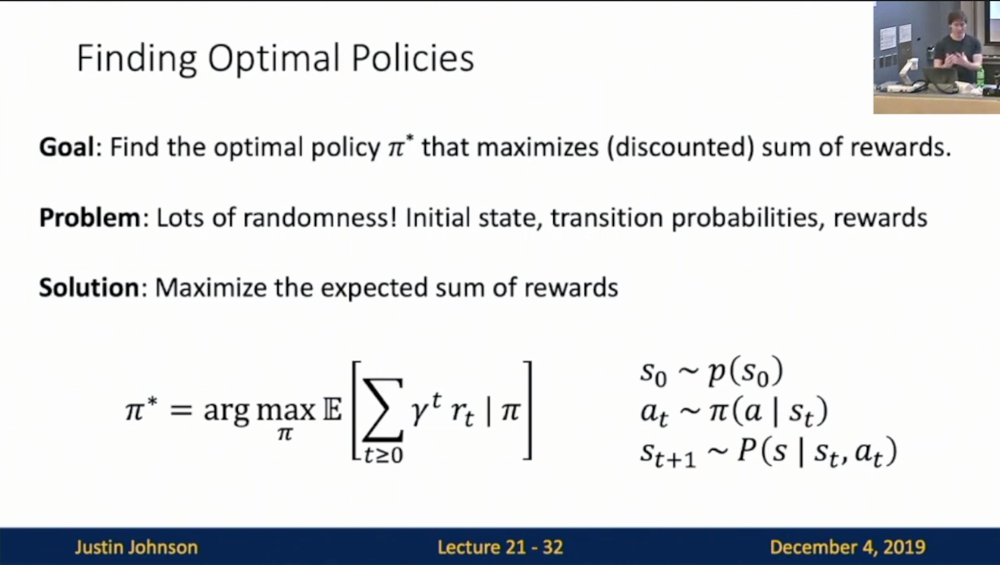

Michigan Online  
Deep Learning for Computer Vision  
Instructor: Justin Johnson  

Lecture 21: Reinforcement Learning

**Overview**
- Task
    - Problems where an **agent** performs **actions** in **environment**, and receives **rewards**
    - **Goal**: Learn how to take actions that maximize reward
- What is reinforcement learning
    - Q-learning
    - Policy Gradients

**Reinforcement Learning**
- Definition
    - Slide 21-9: The agent sees a **state**; may be noisy or incomplete
     
    
    - Slide 21-10: The agent makes an **action** based on what it sees
     
    
    - Slide 21-11: **Reward** tells the agent how well it is doing
     
    
    - Slide 21-12:
        - Action causes change to environment
        - Agent learns
     
    
    - Slide 21-13: Process repeats
     
    
- Example: Cart-Pole Problem
    - **Objective**: Balance a pole on top of a movable cart
    - **State**: angle, angular speed, position, horizontal velocity
    - **Action**: horizontal force applied on the cart
    - **Reward**: 1 at each time step if the pole is upright
- Example: Robot Locomotion
    - **Objective**: Make the robot move forward
    - **State**: Angle, position, velocity of all joints
    - **Action**: Torques applied on joints 
    - **Reward**: 1 at each time step upright + forward movement
- Example: Atari Games
    - **Objective**: Complete the game w/ the highest score
    - **State**: Raw pixel inputs of the game screen
    - **Action**: Game controls e.g. Left, Right, Up, Down
    - **Reward**: Score increase/decrease at each time step
- Example: Go
    - **Objective**: Win the game!
    - **State**: Position of all pieces
    - **Action**: Where to put the next piece down
    - **Reward**: On last turn: 1 if you won, 0 if you lost
- Why is RL different from normal supervised learning?
    - Slide 21-20: **Stochasticity**: Rewards and state transitions may be random
     
    
    - Slide 21-21: **Credit assignment**: Reward r_t may not directly depend on action a_t
     
    
    - Slide 21-22: **Nondifferentiable**: Can’t backprop through world; can’t compute dr_t/da_t
     
    
    - Slide 21-23: **Nonstationary**: What the agent experiences depends on how it acts
     

- Markov Decision Process (MDP)
    - Slide 21-24
        - Mathematical formalization of the RL problem: A tuple (S, A, R, P, gamma)
        - **Markov Property**: The current state completely characterizes the sate of the world. Rewards and next states depend only on current state, not history.
     
    
    - Slide 21-26
        - Agent executes a **policy** pi giving distribution of actions conditioned on states
        - **Goal**: Find policy pi that maximizes cumulative discounted reward
     
    
    - Slide 21-27
    
    
- A simple MDP: Grid World
- Find optimal Policies: Slide 21-32
    - **Goal**: Find the optimal policy pi that maximizes (discounted) sum of rewards
    - **Problem**: Lots of randomness! Initial state, transition probabilities, rewards
    - **Solution**: Maximize the expected sum of rewards
 

- Value Function and Q Function: Slide 21-35
 

- Bellman Equation: Slide 21-39
    - Optimal Q-function
    - Bellman Equation
    - Intuition
 

- Solving for the optimal policy
    - Slide 21-44: Value Iteration
        - Idea: If we find a function Q(s, a) that satisfies the Bellman Equation, then it must be Q*. Start with a random Q, and use the Bellman Equation as an update rule:
        - **Amazing fact**: Q_i converges to Q* as i —> infinity
        - Problem: Need to keep track of Q(s, a) for all (state, action) pairs - impossible if infinite
     
    
    - Slide 21-48: Deep Q-Learning
        - Problem: 
            - Nonstationary!
            - How to sample batches of data for training?
     
    
- Q-Learning
    - Q-Learning: Train network Q_theta(s, a) to estimate future rewards for every (state, action) pair
    - Problem:
        - For some problems this can be a hard function to learn
        - For some problems it is easier to learn a mapping from states to actions
    - Policy Gradients: Train a network pi_theta(a | s) that takes state as input, gives distribution over which action to take in that state
- Policy Gradients: 
    - Slide 21-57
        - Objective function: Expected future rewards when following policy pi_theta
        - Find the optimal policy (Use gradient ascent!)
        - Problem: Nondifferentiability! Don’t know how to compute
        - General formulation
     
    
    - Slide 21-65: REINFORCE Algorithm
        - Approximate the expectation vis sampling!
     
    
    - Slide 21-71
     
    
    - Slide 21-81
     
    
    - Slide 21-82
        - Intuition: 
            - When f(x) is high: Increase the probability of the actions we took
            - When f(x) is low: Decrease the probability of the actions we took
     
    
- Other approaches: Model Based RL
    - Actor-Critic
    - Model-Based
    - Imitation Learning
    - Inverse Reinforcement Learning
    - Adversarial Learning
- Reinforcement Learning: Stochastic Computation Graphs
    - Slide 21-102
        - Can also use RL to train neural networks with **nondifferentiable** components
     
    
    - Slide 21-104: Hard Attention
     

**Summary**
- RL trains agents that interact with an environment and learn to maximize reward
- Q-Learning
- Policy Gradients
