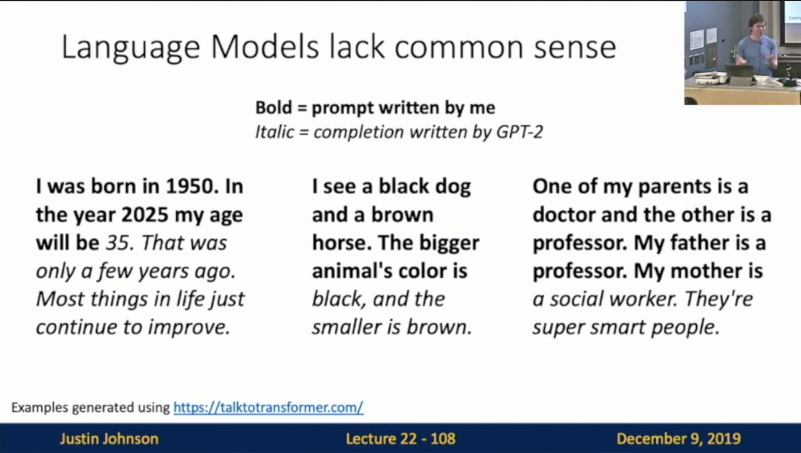

Michigan Online  
Deep Learning for Computer Vision  
Instructor: Justin Johnson  

Lecture 22: Conclusion

**What’s Next?**
- Predictions
    - Prediction #1: We will discover interesting new types of deep model
        - Example: Neural ODE: Slide 22-62
         
    - Prediction #2: Deep Learning will find new applications
    - Prediction #3: Deep Learning will use more data and compute
- Problems
    - Problem #1: Models are biased
        - Vector Arithmetic with Word Vectors: Slide 22-74
            - Gender Bias in Word Vectors
         
        
        - Economic Bias in Visual Classifiers: Slide 22-79
            - Commercial object recognition systems work best for objects found in high-income western households
         
        
        - Racial Bias in Visual Classifiers
    - Problem #2: Need new theory?
        - Empirical Mystery
            - Good Subnetworks
            - Generalization: Slide 22-89, 22-90
             
             
            
    - Problem #3: Deep Learning needs a lot of labeled training data
        - New Datasets for Low-Shot Learning: Slide 22-94, 22-96
         
         
        
        - Using Unlabeled Data: Self-Supervised Learning
            - Step 1: Train a can ON SOME “pretext task” that does not require labeled data
            - Step 2: Fine-tune CVNN on target task (hopefully using not much labeled data)
            - Examples:
                - Jigsaw Puzzles: Slide 22-98
                 
                
                - Colorization: Slide 22-99
                 
                
                - Inpainting: Slide 22-100
                 
                
            - State of the Art
                - Contrasive Predictive Coding
                - Contrasive Multivew Coding
                - Momentum Contrast
                - Pretext-Invariant Representations
    - Problem #4: Deep Learning doesn’t “Understand” the world
        - Language Models lack common sense: Slide 22-108
         
        
        - “The Elephant in the Room”

**Summary**
- Predictions
    - New deep learning models
    - New applications
    - More compute, new hardware
- Problems 
    - Models are biased 
    - Need new theory
    - Using less data
    - Understanding the world
