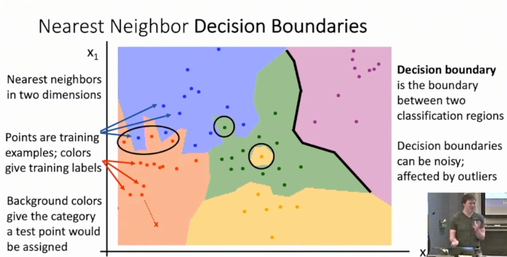

Michigan Online  
Deep Learning for Computer Vision  
Instructor: Justin Johnson  

Lecture 2: Image Classification

- A core computer vision task
    - Input: image
    - Output: Assign image to one of a fixed set of categories
- Problem: Semantic Gap
    - An image is just a big grid of numbers between [0, 255]
    - e.g. 800*600*3 (3 channels RGB)
- Challenges: Viewpoint Variation
    - All pixels change when the camera moves
- Challenges: Intraclass Variation
    - Ex: They are all cats but with different color
- Challenges: Fine-Grained Categories
    - Ex: Tell differences between pug and shetland
- Challenges: Background Clutter
    - Ex: Natural camo
- Challenges: Illumination Changes
    - Ex: Light
- Challenges: Deformation
    - Ex: Same cat, different poses
- Challenges: Occlusion
    - Ex: A tail hiding under cushion of sofa

- Image Classification: Building Block for other tasks
    - Example: Object Detection
    - Example: Image Captioning
        - Sequence: Man —> Riding —> Horse —> <STOP>
    - Example: Playing Go

**Image Classifier**
- Hard-code
    - No obvious way to hard-code the algorithm for recognizing a cat, or other classes
    - One thing you could try find edges —> find corners (ex. Cat ears)
    - Not a good approach
- Machine Learning
    - **Data-Driven** Approach
    - Steps
        - 1) Collect a dataset of images and labels
        - 2) Use ML to train a classifier
        - 3) Evaluate the classifier on new images
    - Two APIs
        - Def train(images, labels)
            - Output: model
        - Def predict(model, test_images)
            - Output: test_labels
    - We only feed images, instead of teaching the machine
- Datasets
    - Image Classification Datasets: MNIST
        - “Drosophila of CV”
        - Results from MNIST often do not hold on more complex datasets
        - Greyscale
    - Image Classification Datasets: CIFAR10
        - Color
        - 10 categories (classes)
    - Image Classification Datasets: CIFAR100
        - 100 categories (classes)
    - Image Classification Datasets: ImageNet
        - 1000 categories (classes)
        - ~1.3K training images
        - Performance metric: Top 5 accuracy
            - Algorithm predicts 5 labels for each image; one of them needs to be right
    - Image Classification Datasets: MIT Places
        - 365 classes of different scene types
    - Image Classification Datasets: Omniglot
        - 1623 categories: characters from 50 different alphabets
        - 20 images per category (class)
        - Meant to test few shot learning (small-data)

**Classification Algorithms**
- First classifier: Nearest Neighbor
    - Train: Memorize all data and labels
    - Predict: Predict the label of the most similar training image
    - Distance Metric to compare images
        - L1 distance 
            - Manhattan Distance
            - Absolute value of differences
    - Nearest Neighbor Classifier
        - Efficiency
            - With N examples, how fast is training?
            - O(1)
            - With N examples, how fast is testing?
            - O(N)
            - This is bad: We can afford slow training, but we need fast testing!
        - There are many methods for fast/approximate nearest neighbors 
        - Decision Boundaries (Slide 2-55)
            - Problem: Outlier 
            - Problem: Rough decision boundaries
     
- K-Nearest Neighbors
    - Instead of copying label from nearest neighbor, take majority vote from K closest points
    - Use more neighbors helps smooth out rough decision boundaries
    - Using more neighbors helps reduce the effect of outliers
    - L2 distance
        - Euclidean distance
    - With the right choice of distance metric, we can apply K-Nearest Neighbor to any type of data
        - Example: Compare research papers using tf-idf similarity
    - Hyperparameters: Choices about our learning algorithm that we don’t learn from the training data; instead we set them at the start of the learning process
        - Examples
            - What is the best value of K to use?
            - What is the best distance metric to use?
        - Very problem-dependent
        - Ideas of setting hyperparameters:
            - Idea #1: Choose hyperparameters that work best on the data
                - BAD: K=1 always works perfect on training data
            - Idea #2: Split data into train and test, choose hyperparameters that work best on test data
                - BAD: No idea how algorithm will perform on new data
                    - If you use your test set for hyperparameter tuning, the test set is no longer unseen data (in other words, polluted)
            - Idea #3: Split data into train, val and test; Choose hyperparameter on val and evaluate on test
                - BEST
                - Very terrifying to implement, but the right thing to do
                - You touch test data ONLY ONCE
            - Idea #4: Cross-validation: Split data into folds, try each fold as validation and average the results
                - K-fold validation
                - Useful for small datasets, but (unfortunately) not used too frequently in DL
    - Universal Approximation
        - As the number of training samples goes to infinity, nearest neighbor can represent any(*) function!
            - Example: Approximate polynomial functions
        - Problem: Curse of Dimensionality
            - For uniform coverage of space, number of training points needed grows exponentially with dimension
    - K-Nearest Neighbor on raw pixels is seldom used
        - Very slow at test time
        - Distance metrics on pixels are not informative
- **Nearest Neighbor with ConvNet features works well!**
    - Very strong baseline of a lot of problems
    - Example: Image Captioning with Nearest Neighbor

**Summary**
- In **Image classification** we start with **a training set** of images and labels, and must predict labels on the **test set**
- Image classification is challenging due to the semantic gap: we need invariance to occlusion, deformation, lighting, intraclass variation, etc
- Image classification is a **building block** for other vision tasks
- The **K-Nearest Neighbors** classifier predicts labels based on nearest training examples
- Distance metric and K are **hyperparameters**
- Choose hyperparameters using the **validation set**; only run on the test set once at the very end!

