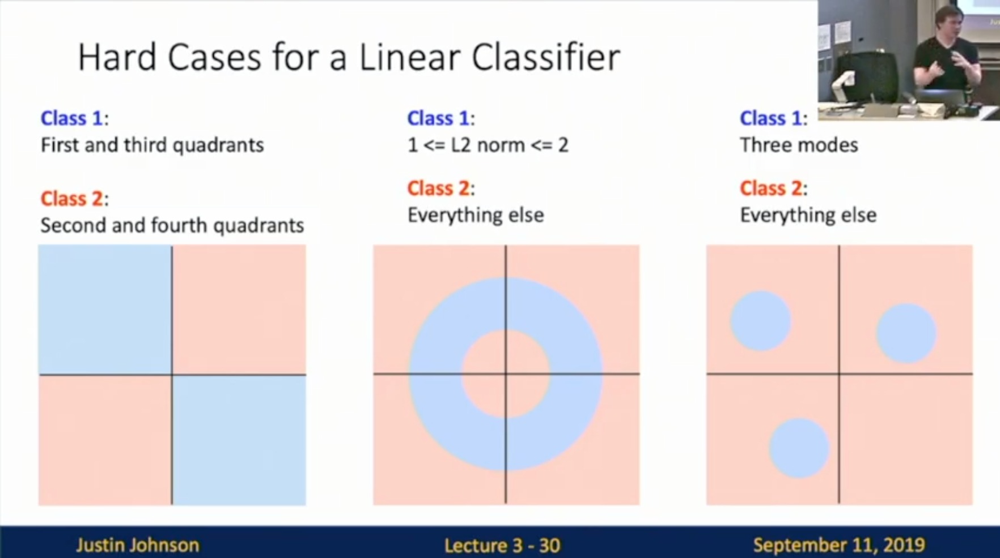
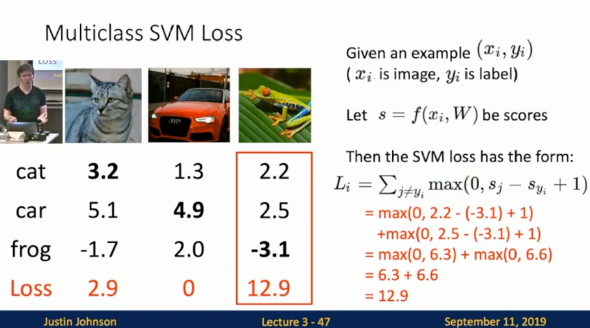

Michigan Online
Deep Learning for Computer Vision
Instructor: Justin Johnson

Lecture 3: Linear Classifiers

Linear Classifiers 
- building blocks of neural network
- Interpreting a Linear Classifier: Algebraic viewpoint
    - Input: image (32*32*3 = 3072 numbers)
    - **f(x, W)**
        - W: parameters or weights
    - 10 numbers giving class scores
- Parametric Approach
    - f(x, W) = Wx + b (algebraic viewpoint)
        - f(x, W): (10, )
        - W: (10, 3072)
        - X: (3072, ) 
            - Stretch pixels into column
        - b: (10, )
            - b stands for bias 
        - Example: Slide 3-14
         
    - Linear Classifier: Bias Trick
        - Example: Slide 3-15
        - Less used in neural network
    - Linear Classifier: Predictions are linear
        - Example with transparency: Slide 3-18
- Interpreting a Linear Classifier: Visual viewpoint
    - Reshape: Do not stretch pixels into column
    - **Linear classifier has one “template” per category**
    - Problem: A single template cannot capture multiple modes of the data
        - e.g. horse template has 2 heads
        - Horses looking at different direction would cause this type of problem
- Interpreting a Linear Classifier: Geometric viewpoint
    - Example: Slide 3-27
    - **Think each category as hyperplane**
        - Hyperplanes carving up a high-dimensional space
     
- Hard Cases for a Linear Classifier
    - Example: Slide 3-30
    - Case 1
        - Class 1: 1st & 3rd quadrants
        - Class 2: 2nd & 4th quadrants
    - Case 2
        - Class 1: 1 <= L2 norm <= 2
        - Class 2: Everything else
    - Case 3
        - Class 1: 3 modes
        - Class 2: Everything else
     

**Choosing a good W**
How can we actually choose W?
1. Use a **loss function** to quantify how good value
2. Find a W that minimizes the loss function (**optimization**)

**Loss Function**
- A loss function tells how good our current classifier is 
    - Low loss = good classifier
    - High loss = bad classifier
    - Negative loss function sometimes called reward function, profit function
    - Loss for the dataset is average of per-example losses:
        - L(f(x, w), Y)
- Multiclass SVM Loss
    - Intuition: The score of the correct class should be higher than all the other scores
    - Keep track of highest score among other classes
    - “Hinge Loss”: Looks like “\_”
        - Slide 3-43
      
    - Example: Slide 3-46
        - 1 stands for margin
      
      
      
    - Question: If all the scores were random, what loss would we expect?
        - C-1 
            - C: # of categories
            - Diff b/w scores for correct category and scores for incorrect category would be 0, then max(0, 0+1) = 1 for one incorrect category
            - Good knowledge for debugging
- Regularization: Beyond Training Error
    - Motivation: How should we choose b/w W and 2W if they both perform the same on the training data?
        - Weight not unique
    - L(W) = Data loss + Regularization
        - Data loss: Model predictions should match training data
        - Regularization: Prevent the model from doing too well on training data
        - Slide 3-61
      
    - Purpose of regularization
        - Express preferences in among models beyond “minimize training error”
        - Avoid **overfitting**: Prefer simple models that generalize better
            - Overfitting definition: Perform really really well in training data, but perform poorly against unseen data
        - Improve optimization by adding curvature
    - Regularization: Expressing Preferences
        - Slide 3-65
        - L2 regularization likes to “spread out” the weights
            - Basically tell the machine to use all available features instead of using one feature only 
            - L1 does the opposite
      
    - Regularization: Prefer Simpler Models
        - Slide 3-67
        - Regularization pushes against fitting the data too well so we don’t fit noise in the data
        - JJ: You should always introduce some regularization to your ML model
      
- Cross-Entropy Loss (Multinomial Logistic Regession)
    - Most commonly used when training neural networks
    - Want to interpret raw classifier scores as **probabilities**
        - Multiclass SVM loss does not give much interpretation
        - Scores can be called unnormalized log-probabilities/logits
    - Introduce softmax function (Slide 3-76)
        - unnormalized log-probabilities/logits 
        - Take exp: —> unnormalized probabilities
            - Probabilities must be >= 0
        - Normalize: —> probabilities 
            - Probabilities must sum to 1
        - Take minus log of correct class’s probability
        - MLE
        - KL divergence
        - Cross Entropy
        - Maximize probability of correct class
      
        - Question: What is the min/max possible loss L?
            - Min: 0
            - Max: infinity
            - Side note: SVM loss == 0 can be achieved. No practical way to get cross-entropy loss = 0
        - Question: If all scores are small random values, what is the loss?
            - Log(C)
            - C: # of categories
            - Good way for debugging/benchmark
                - Example: Suppose 10 category, the starting point should be log(10) = 2.3
- Cross-Entropy vs SVM Loss
