Michigan Online  
Deep Learning for Computer Vision  
Instructor: Justin Johnson  

Lecture 4: Optimization

**How do we find the best W?**
- w* = argmin L(w)
    - L: Loss function
- Imagine to walk towards bottom of a high-dimensional landscape
    - Slide 4-12
    - Next question: How do we get to the bottom?
        - Try iterative methods
    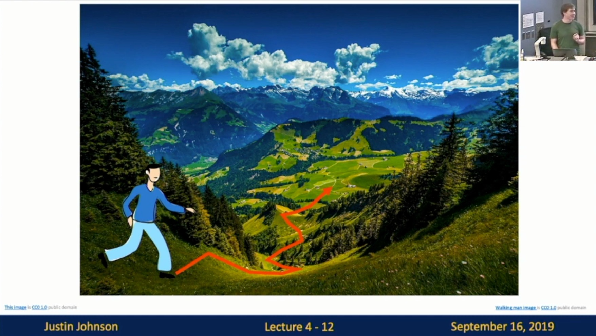 

**Iterative Methods**
- Idea #1: Random Search (bad idea!)
- Idea #2: Follow the slope
    - Given local information, step towards greater decrease
    - In 1-dimension, the **derivative** of a function gives the slope 
        - Slide 4-18
    - In multiple dimensions, the gradient is the vector of (partial derivatives) along each dimension
    - The slope in any direction is the dot product of the direction with the gradient
    - The direction of steepest descent is the negative gradient
    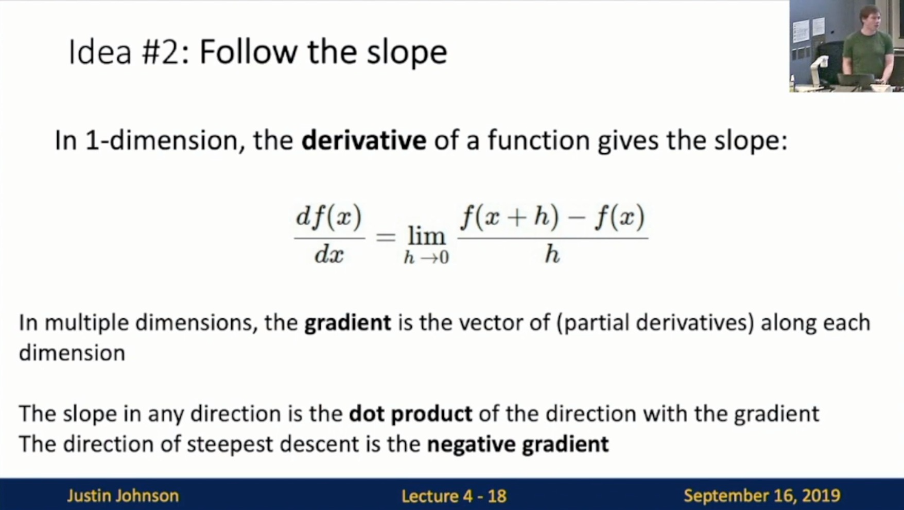 
    
    - Numeric Gradient
        - Slow: O(#dimensions)
        - Approximate
    - Analytic gradient
        - Use calculus to compute an analytic gradient
            - Slide 4-28
        - In practice we will compute dL/dW using backpropagation
    - Computing Gradients
        - **Numeric gradient**: approximate, slow, easy to write
        - **Analytic gradient**: exact, fast, error=prone
        - In practice: Always use analytic gradient, but check implementation with numerical gradient (JJ: used for debugging tool). This is called a **gradient check**
            - PyTorch provides a function called ‘torch.autograd.gradcheck’
            - ‘torch.autograd.gradgradcheck’ for second derivative

**Gradient Descent**
- Batch Gradient Descent
    - Iteratively step in the direction of the negative gradient (direction of local steepest descent)
    - Hyperparameters
        - Weight initialization method
            - Will talk about the technique later
        - Number of steps
            - Many different stop criteria
        - Learning rate
            - How much do we trust the gradient? 
            - Controls how fast your network learns
    - Some phenoms
        - It does not go straight to the bottom
        - It goes fast, then slow when approaching flat regions
    - Batch Gradient Descent
        - Full sum expensive when N is large!
        - Slide 4-38
        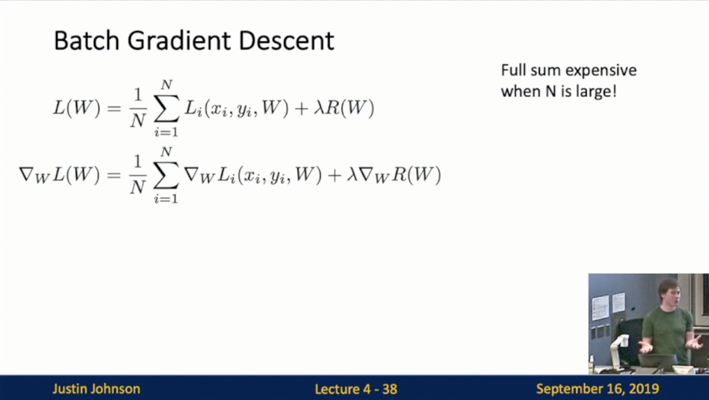 
- Stochastic Gradient Descent (SGD)
    - Slide 4-39
    - Approximate sum using a **minibatch** of examples 
    - 32/64/128 common
    - Hyperparameters
        - Weight Initialization
        - Number of steps
        - Learning rate
        - Batch size
            - JJ: Don’t worry too much. Try to fit as big as you can
        - Data sampling
    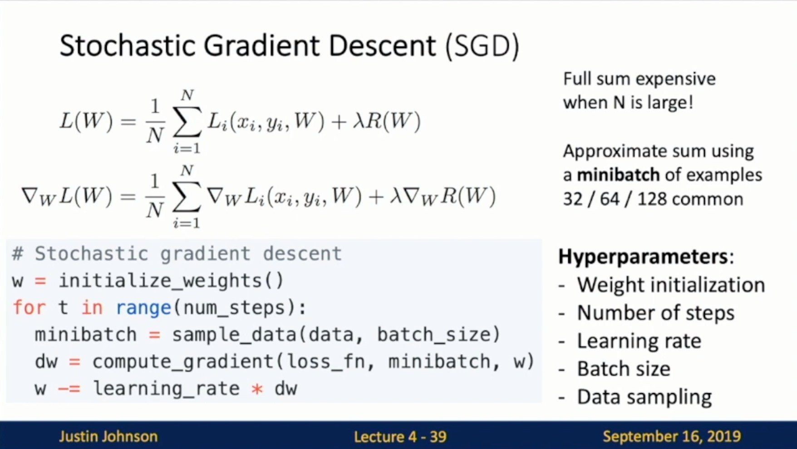 
    
    - Intuition
        - Think of loss as an expectation over the full **data distribution**
        - Approximate expectation via sampling
        - Slide 4-41
    - Problems with SGD
        - What if loss changes quickly in one direction and slowly in another? What does gradient descent do? 
            - Slide 4-44
            - Dilemma: Very slow progress along shallow dimension, jitter along steep direction
            - Loss function has high **condition number**: ratio of largest to smallest singular value of the Hessian matrix is large
            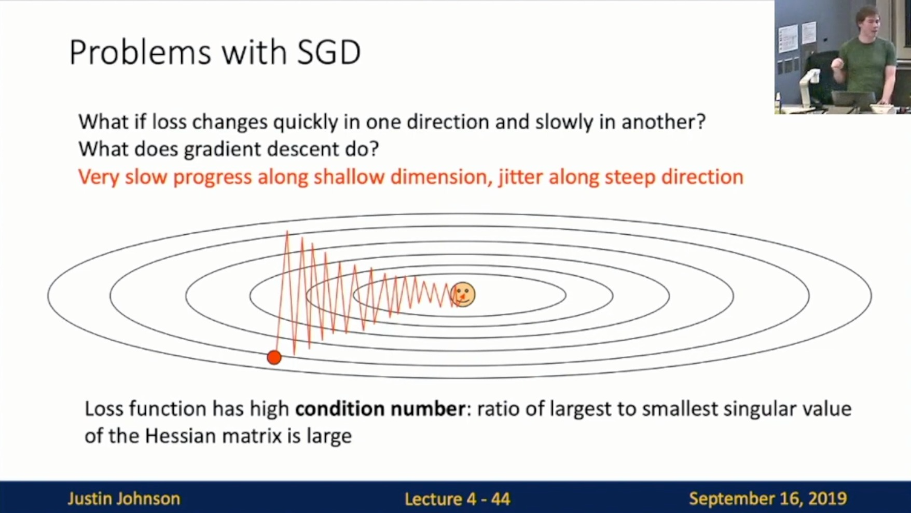 
            
        - What if the loss function has a **local minimum** or **saddle point**?
            - Slide 4-45
            - Zero gradient, gradient descent gets stuck
            - JJ: This becomes more common in high-dimension
            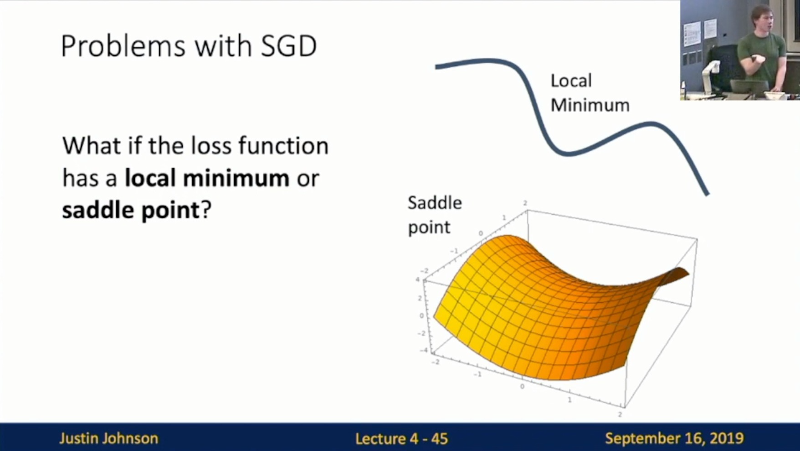 
            
        - Our gradients come from minibatches so they can be noisy
            - Slide 4-47
            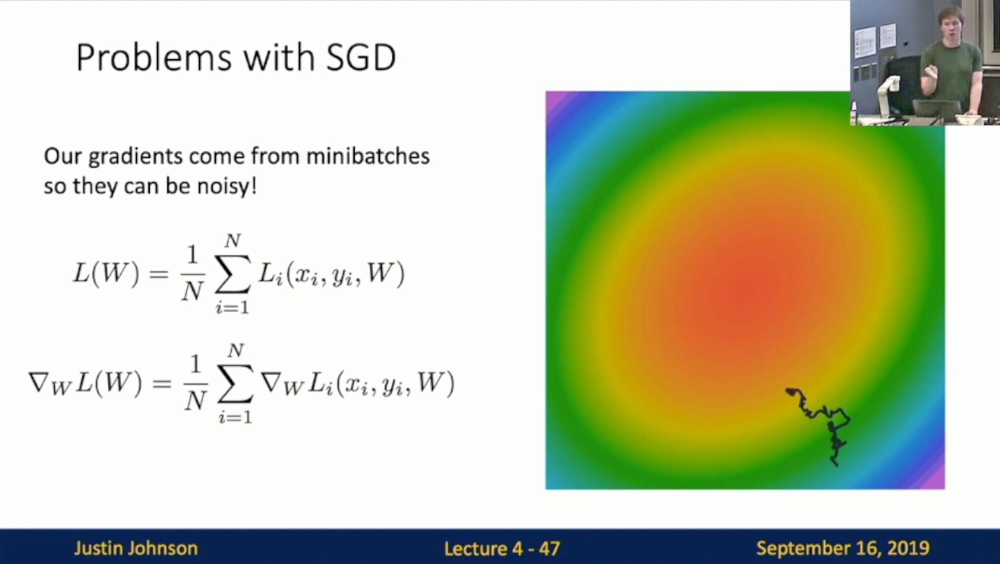 
            
    - Counter: SGD + Momentum
        - Momentum
            - Slide 4-49
            - Building up “velocity” as a running mean of gradients
            - Rho gives “friction”; typically rho=0.9 or 0.99
            - Think about rolling a ball down the landscape/hill
            - You may see SGD+Momentum formulated different ways, but they are equivalent - give same sequence of x
            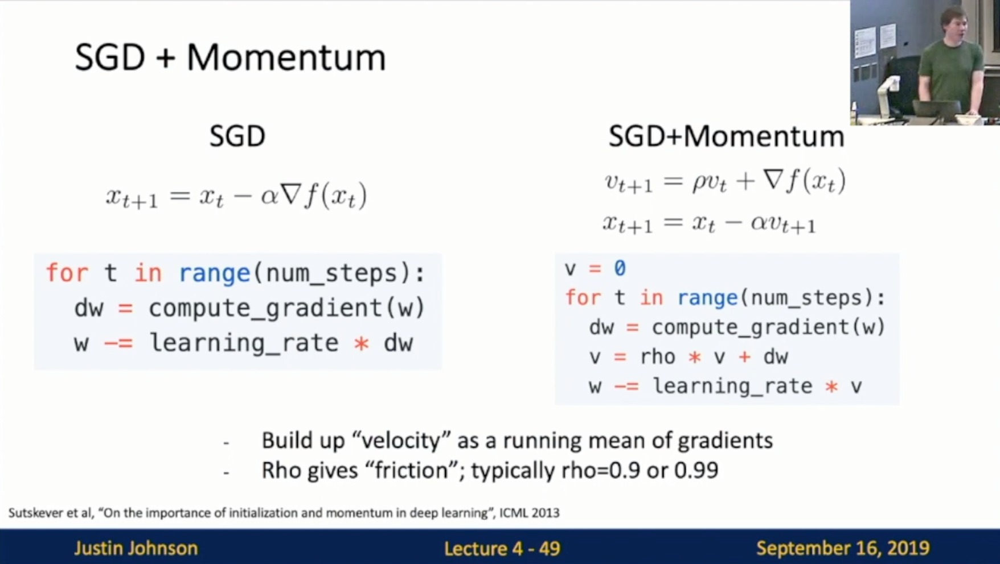 
            
        - Momentum update
            - Slide 4-53
            - Combine gradient at current point with velocity to get step used to update weights
            - Nesterov Momentum
                - “Look ahead” to the point where updating using velocity would take us; compute gradient there and mix it with velocity to get actual update direction
                - Slightly different way 
            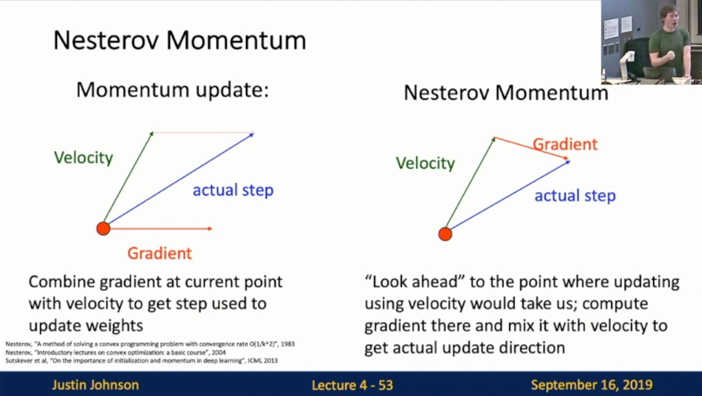 
            
- AdaGrad (square)
    - Slide 4-58
    - Added element-wise scaling of the gradient based on the historical sum of squares in each dimension
    - “Per-parameter learning rates” or “adaptive learning rates”
    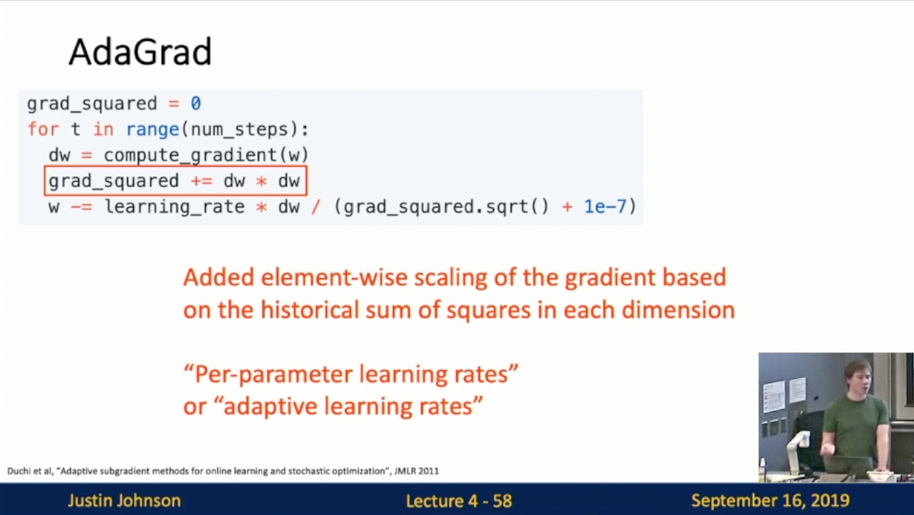 
    
    - What happens with AdaGrad?
        - Progress along “steep” directions is damped
        - Progress along “flat” directions is accelerated
    - Problem: Grad square may be too big —> Stop progress before getting to the bottom
    - Counter: RMSProp
        - Slide 4-62
        - “Leak Adagrad”
        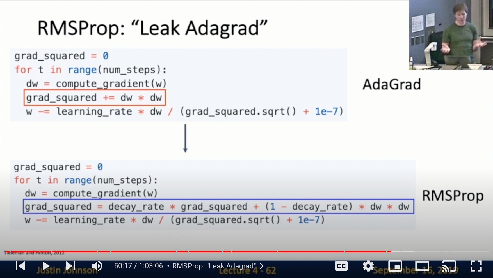 
        
- Momentum vs AdaGrad
    - Slide 4-63
    - Momentum tends to overshoot
    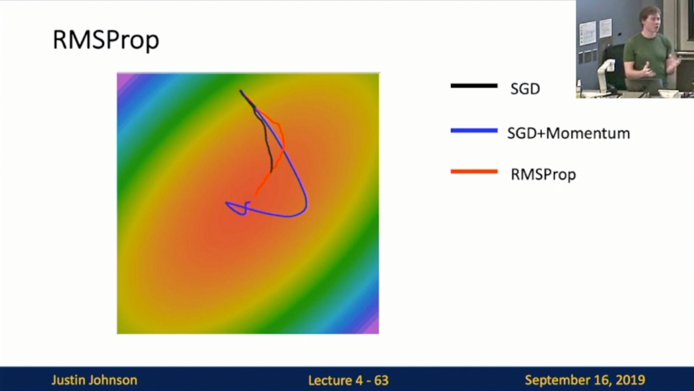 
    
- Adam (almost): RMSProp + Momentum
    - Slide 4-64
    - Intuition: Why not combine them together?
    - First moment (Momentum)
    - Second moment (AdaGrad/RMSProp)
    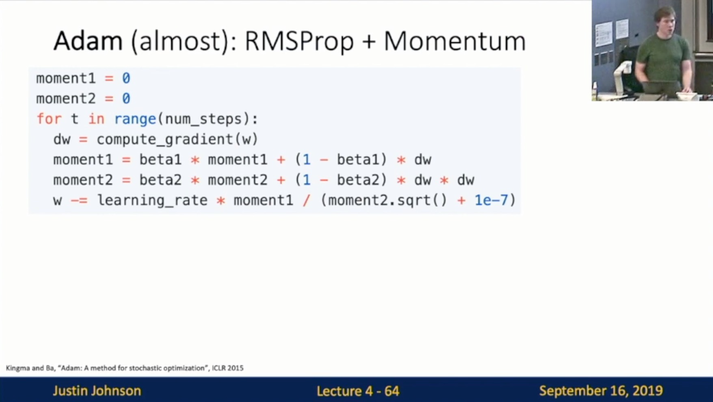 
    
    - What happens at t=0? (Assume beta2 = 0.999)
        - Introduce bias correction
    - Slide 4-69
    - **Bias correction** for the fact that first and second moment estimates start at zero
        - JJ: My go-to setup
    - Very Common in Practice!
    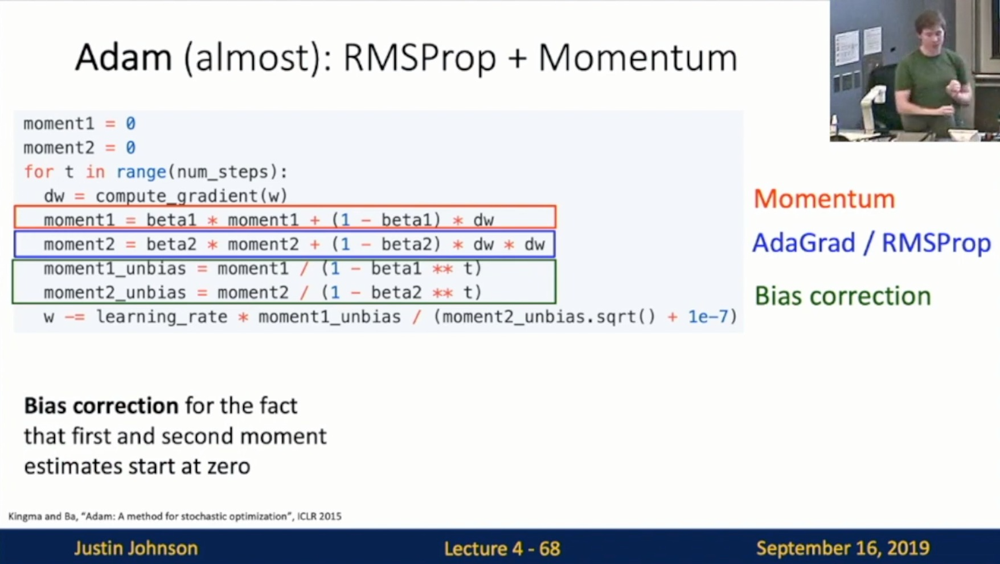 
    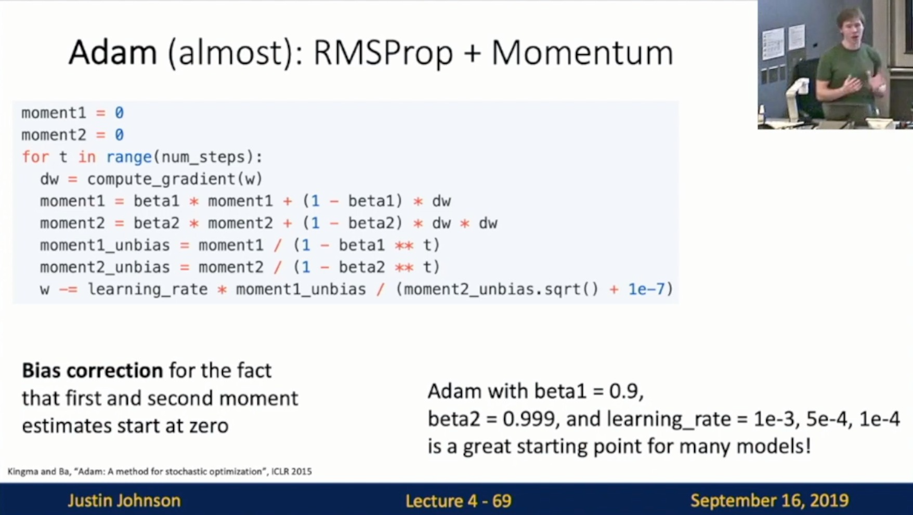 
    
- Comparison: Slide 4-71
    - Have properties of both SGD+Momentum and RMSProp
    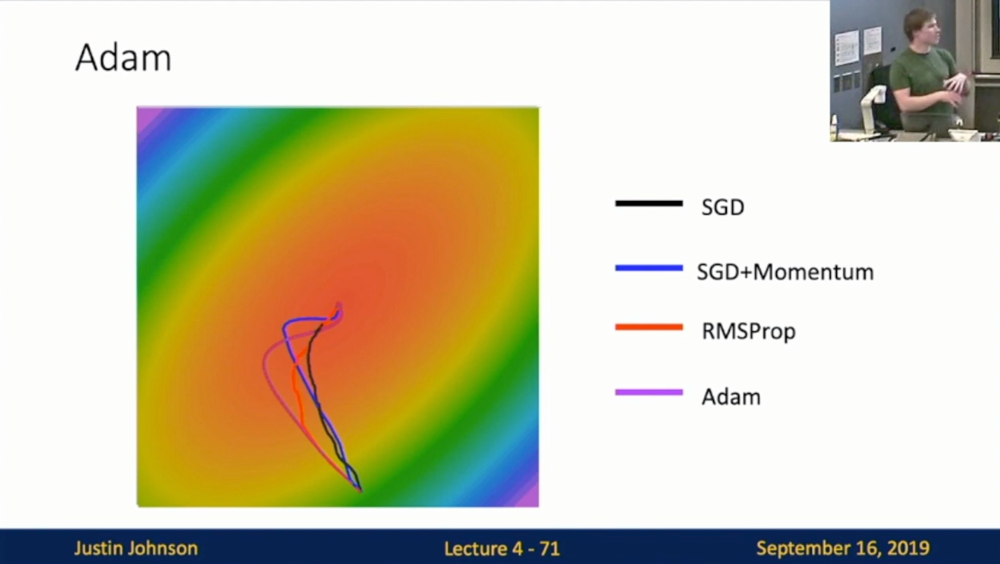 
    
    - Slide 4-72
    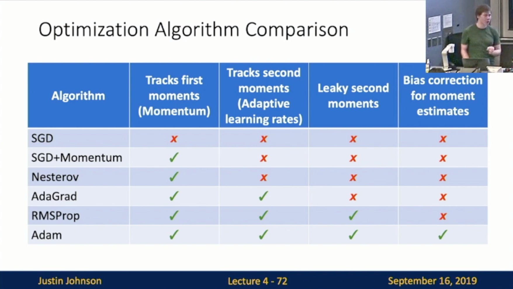 

**Second-Order Optimization**
- So far: **First-Order** Optimization
    1. Use gradient to make linear approximation
    2. Step to minimize approximation
- *Second-Order** Optimization
    - Slide 4-76
    1. Use gradient and Hessian to make quadratic approximation
    2. Step to minimize the approximation
    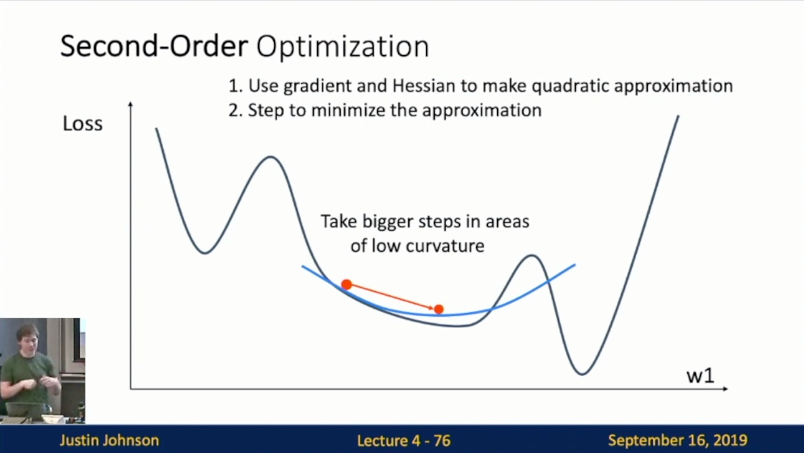 
    
- Why is this impractical?
    - Slide 4-79
    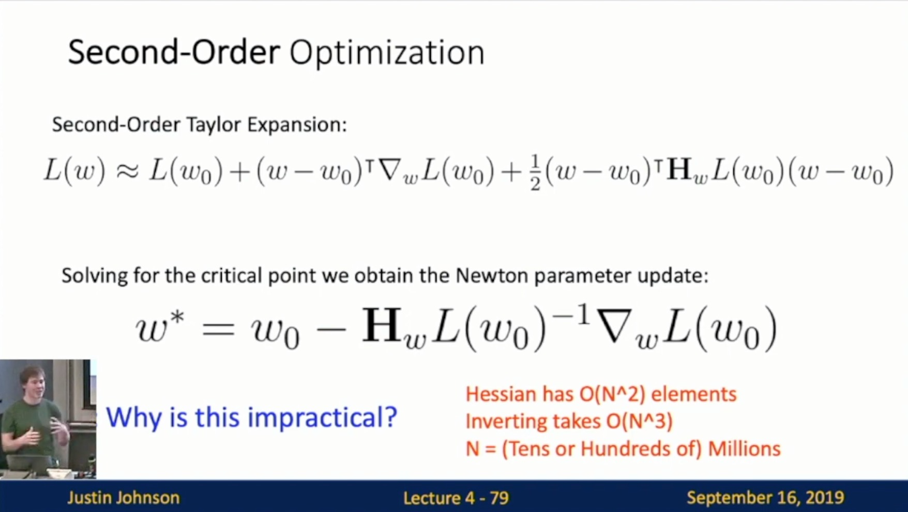 

In practice:
- **Adam** is a good default choice in many cases. **SGD+Momentum** can outperform Adam but may require more tuning
- If you can afford to do full batch updates then try out L-BFGS 
    - L-BFGS: a type of second order optimization

**Summary**
1. Use **Linear Models** for image classification problems
2. Use **Loss Functions** to express preferences over different choices of weights
3. Use **Stochastic Gradient Descent** to minimize our loss functions and train the model
