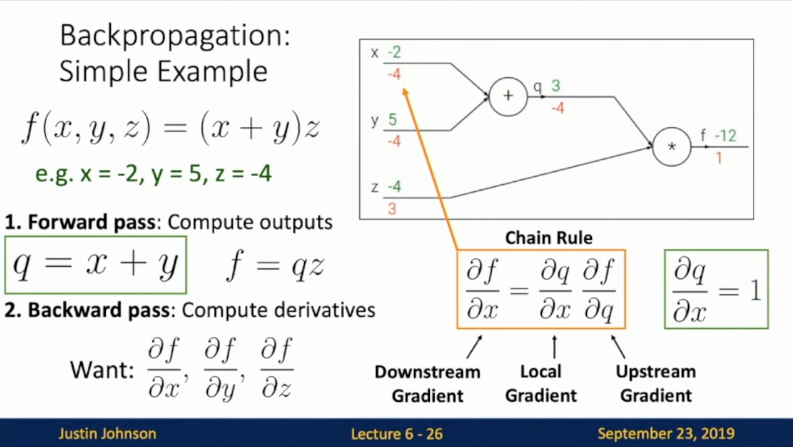
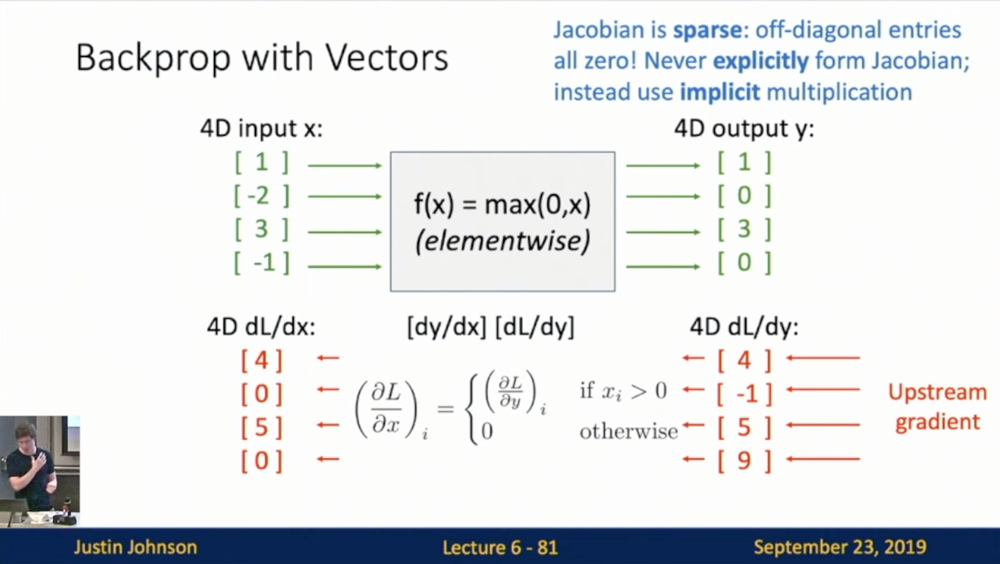
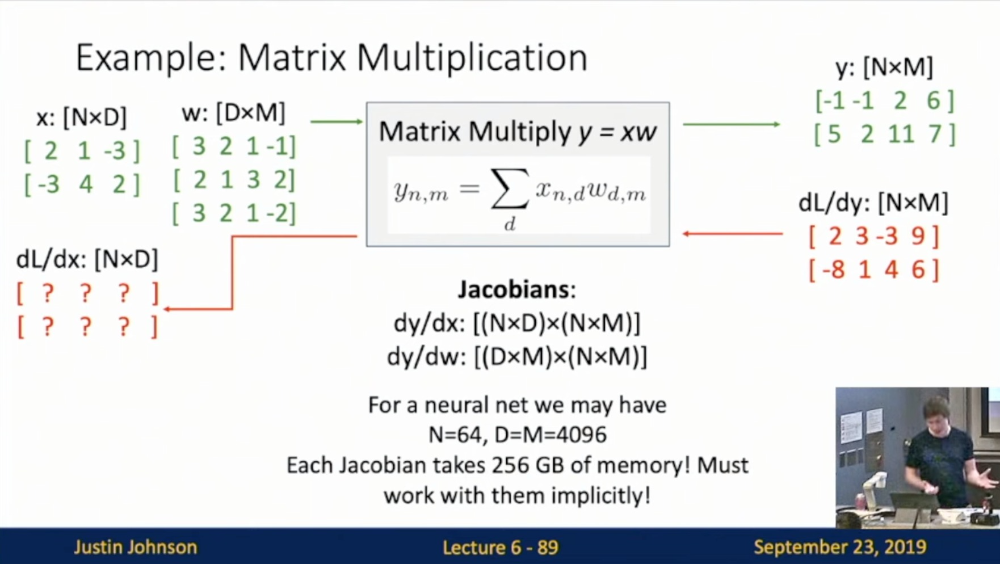
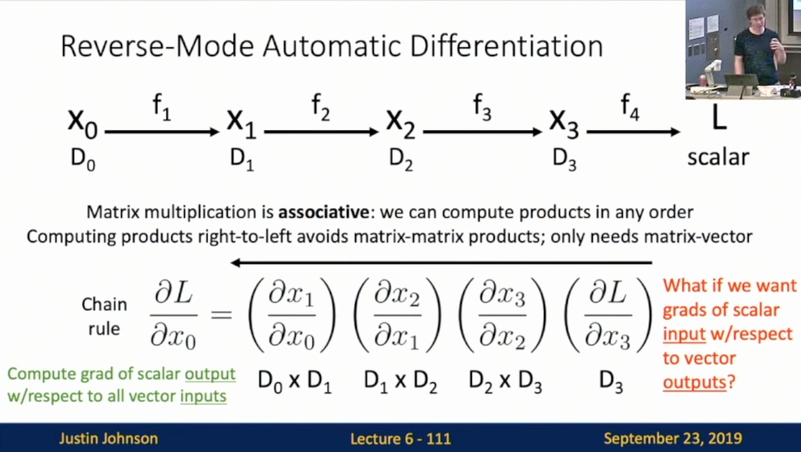

Michigan Online  
Deep Learning for Computer Vision  
Instructor: Justin Johnson  

Lecture 6: Backpropagation

- Problem: How to compute gradients?
    - Slide 6-5
     
- (Bad) Idea: Derive on paper
    - Slide 6-6
     
    
    - Problem: Very tedious: Lots of matrix calculus, need lots of paper
    - Problem: What if we want to change loss? E.g. use softmax instead of SVM? Need to re-derive from scratch. Not modular!
    - Problem: Not feasible for very complex models!
- Better Idea: Computational Graphs
    - Simple: Slide 6-7
     
    
    - Complex: Slide 6-8
     

**Backpropagation (with scalars)**
- JJ: Used to compute gradients of computational graphs
- Simple Example
    - Steps
        - Forward pass: Compute outputs
        - Backward pass: Compute derivatives/gradients
            - Slide 6-16
             
            
            - Slide 6-18
             
            
            - Slide 6-20
             
            
            - Slide 6-26
                - Downstream Gradient
                - Local Gradient
                - Upstream Gradient
             
            
- Useful because it is MODULAR
    - JJ: Each little piece of graphs does not need to know or care about the rest of the graph. We can just perform local processing within each node. and by aggregating those local processing, we can end up computing global derivatives throughout the entire graph
    - A singular mode
        - Forward pass: Slide 6-27
         
        
        - Backward pass: Slide 6-31
         
        
- Another Example: Logistic classifier
    - One node at a time
        - Forward pass: Slide 6-33
         
        
        - Backward pass(Compute gradients): Slide 6-35, 6-42
         
         
    - JJ: There are multiple ways that we can construct the backward pass. There is an easier way to compute.
        - Introduce Sigmoid: Slide 6-44, 6-45
        - Computational graph is not unique: we can use primitives that have simple local gradients
         
         
- Patterns in Gradient Flow
    - Slide 6-49
    - **add** gate: gradient distributor
        - JJ: The same gradients go back
    - **copy** gate: gradient adder
        - JJ: Identical copies to use in different ways
    - **mul** gate: “swap multiplier”
    - **max** gate: gradient router
        - JJ: Look like ReLU a little bit
     
- Backprop Implementation
    - “Flat” gradient code
        - Slide 6-51
         
        
        - Forward pass: Compute output
        - Backward pass: Compute grads
            - Steps:
                - Base case: Slide 6-52
                 
                
                - Sigmoid: Slide 6-53
                 
                
                - **add** gate: Slide 6-54
                 
                
                - **mul** gate: Slide 6-56
                 
        - Your gradient code should look like a “reversed version” of your forward pass!
        - Problem: Not MODULAR
    - Modular API
        - Graph (or Net) object: Slide 6-60
         
        
        - PyTorch Autograd Functions: Slide 6-61
         
        
        - PyTorch sigmoid layer: Slide 6-66
         

**Backpropagation (vector-valued)**
- So far: backprop with scalars
- What about vector-valued functions?
- Recap: Vector Derivatives
    - Slide 6-70
    - Regular derivative
    - Derivative is **Gradient**
    - Derivative is **Jacobian**
     
- Backprop with Vectors
    - Steps: Slide 6-74
        - **Loss L still a scalar**
        - Local Jacobian matrices
        - Matrix-vector multiply
     
    
    - ReLU function: Slide 6-77, 6-80
        - Jacobian Matrix representation of ReLU
            - JJ: It’s diagonal
         
         
        
        - Jacobian is **sparse**: off-diagonal entires all zero! Never **explicitly** form Jacobian; instead use implicit multiplication
            - Example of implicit multiplication: Slide 6-81 
             

**Backprop with Matrices (or Tensors)**
- Backprop with Matrices (or Tensors 
    - Steps:
        - Slide 6-86
        - **Loss L still a scalar**
        - Local Jacobian matrices
            - JJ: Generalized form; “flattening”
        - Matrix-vector multiply
         
- JJ: Strategy to use regarding how to implement these types of operations without thinking about high-rank tensors
    - Example: Matrix Multiplication
        - Jacobian:
            - Slide 6-89
            - JJ: Memory will explode
             
        - Implicit: 
            - Slide 6-93, 6-96
            - JJ: Think about element-wise. Try to compute a ‘slice’ of local gradients
             
             
            
            - General Expression: Slide 6-106
                - JJ: Weight matrix = local gradient slice, so we can forget about local gradient slice and use weight matrices
                - Easy way to remember: It’s the only way the shapes work out!
             

**Backpropagation: Another View**
- Reverse-Mode Automatic Differentiation
    - Chain rule
    - Slide 6-110
        - Matrix multiplication is **associative**: we can compute products in any order
        - Computing products right-to-left avoids matrix-matrix products; only needs matrix-vector
     
    
    - Slide 6-111
        - Compute grad of scalar output w/ respect to all vector inputs
        - What if we want grads of scalar input w/respect to vector outputs
     
    
- Forward-Mode Automatic Differentiation
    - Slide 6-114
    - Why we want to do this? In ML, we want to compute loss
        - JJ: Good to have something automatically compute the gradients when we are not minimizing the loss function
        - JJ: Generally useful beyond ML
        - Computing products left-to-right avoids matrix-matrix products; only needs matrix-vector
        - Not implemented in PyTorch/Tensorflow
     
- Backprop: Higher-Order Derivatives
    - Slide 6-117, 6-120, 6-121
    - **Hessian matrix**: H of second derivatives
    - This is implemented in PyTorch/Tensorflow
    - Example: Regularization to penalize the norm of gradient
     
     
     

**Summary**
- Represent complex expressions as **computational graphs**
- During the backward pass, each node in the graph receives **upstream gradients** and multiplies them by **local gradients** to compute **downstream gradients**
- Backprop can be implemented with “flat” code where the backward pass looks like forward pass reversed
- Backprop can be implemented with a modular API, as a set of paired forward/backward functions
