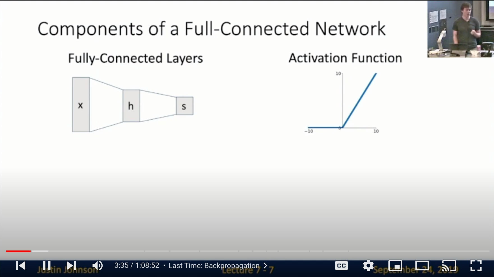
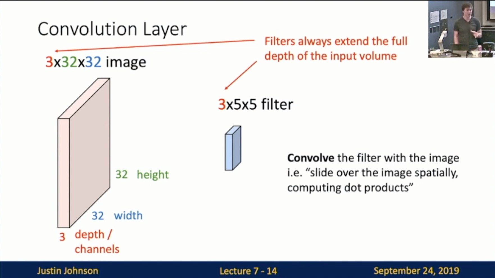
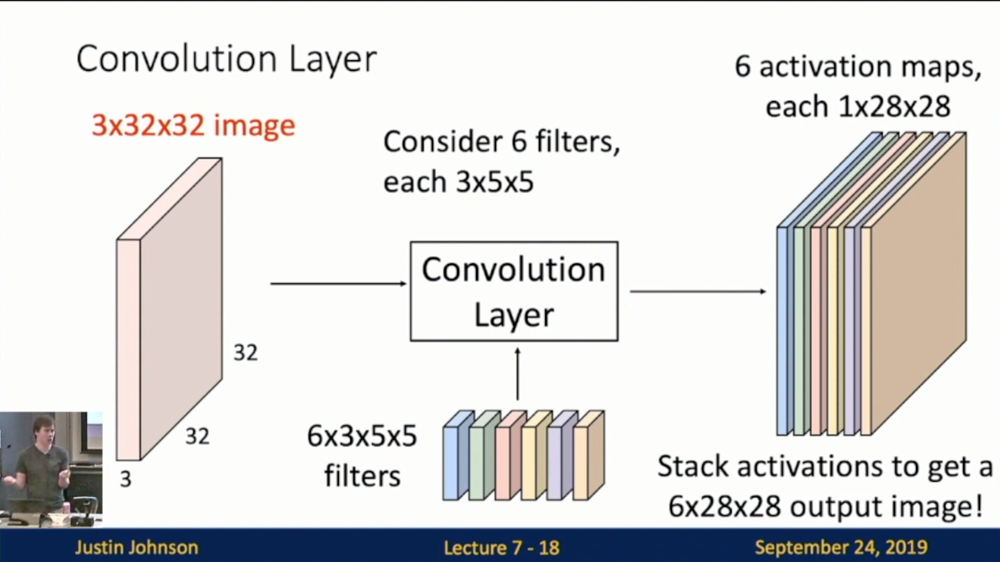
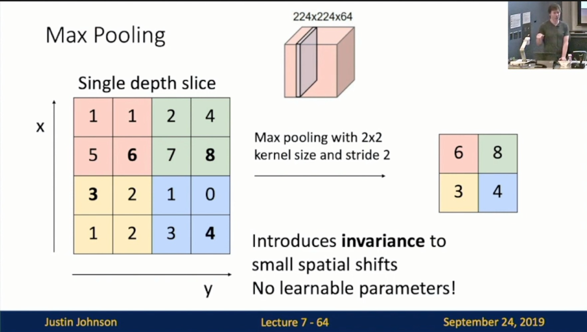
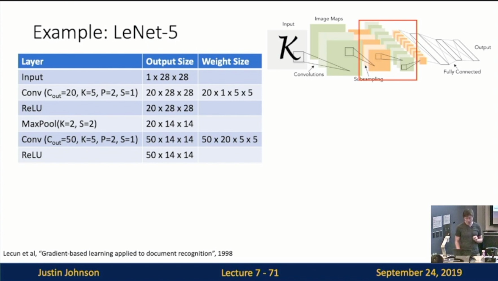

Michigan Online  
Deep Learning for Computer Vision  
Instructor: Justin Johnson  

Lecture 7: Convolutional Networks

**Last Lecture**
- Status: Stretch pixels into column
- Problem: So far our classifiers don’t respect the spatial structure of images
    - f(x, W) = Wx
    - W_2 max(0, W_1 x)
**This Lecture**
- Solution: Define new computational nodes that operate on images!

**Convolutional Network**
- Components of a Full-Connected Network
    - Fully-Connected Layers
    - Activation Function
     
- Components of a Convolutional Network
    - Fully-Connected Layers
    - Activation Function
    - Convolution Layers
    - Pooling Layers
    - Normalization
     

**Three New Operations**  
**Convolution Layers**
- Fully-Connected Layer: Slide 7-10
 
- Convolution Layer: 
    - Slide 7-14
        - Input: 3D tensor
            - 3 * 32 * 32 image: preserve spatial structure
        - Weight matrix 
            - 3 * 5 * 5 filter
            - **Convolve** the filter with the image
            - i.e. “slide over the image spatially, computing dot products”
        - Filter always extend the full depth of the input volunme
         
    - Slide 7-15
        - Output: 1 number
            - The result of taking a dot product b/w the filter and a small 3*5*5 chunk of the image
            - i.e. 3 * 5 * 5 = 75-dimensional dot product + bias
         
    - Slide 7-16
        - Convolve (slide) over all spatial locations
        - Activation map
            - 1 * 28 * 28
         
    - Slide 7-17
        - Consider repeating with a second (green) filter
         
    - Slide 7-18
        - Consider 6 filters
            - Each 3 * 5 * 5
        - 6 activation maps
            - Each 1 * 28 * 28
            - JJ: 32+1-5=28
        - Stack activations to get a 6 * 28 * 28 output image!
         
    - Slide 7-19
        - Also 6-dim bias vector
         
    - Slide 7-21, 7-22
        - Batch of images 
        - Batch of outputs
         
	 
- Stacking Convolutions
    - Slide 7-23, 7-25 (Correction: b_1 should be 6 instead of 5)
    - Problem: What if we stack two convolution layers?
    - We get another convolution!
        - Recall y=W2W1x is a linear classifier
    - Solution: ReLU 
        - Non-linear activation function
     
     
- What do convolutional filters learn?
    - Slide 7-29
    - First-layer conv filters: local image templates 
        - Often learns oriented edges, opposing colors
        - Example:L AlexNet
     
- A closer look at spatial dimensions
    - Slide 7-36
        - Example
            - Input: 7 * 7
            - Filter: 3 * 3
            - Output: 5 * 5
        - In general
            - Input: W
            - Filter: K
            - Output: W-K+1
        - Problem: Feature maps “shrink” with each layer!
            - To be specific: Lose at least 2 pixels every time thru a filter
     
    
    - Slide 7-37
        - Solution: **padding**
            - Add zeros around the input (Zero padding)
     
    
    - Slide 7-38
        - In general
            - Input: W
            - Filter: K
            -  Padding: P
            - Output: W-K+1+2P
        - Very common: set P = (K-1) / 2 to make output have same size as input!
      
    
- Receptive Fields
    - Slide 7-39
    	- For convolution with kernel size, each element in the output depends on a K*K **receptive field** in the input
      
    
    - Slide 7-40
    	- Each successive convolution add K-1 to the receptive field size With L layers the receptive field size is 1+L*(K-1)
    
    
    - Slide 7-42
    	- Problem: For large images we need many layers for each output to “see” the whole image 
    	- Solution: Downsample inside the network
        	- JJ: Equivalent to adding another hyperparameter
    
- **Strided** Convolution
    - Slide 7-43, 7-44, 7-46
    	- Example
    		- Input: 7 * 7
        	- Filter: 3 * 3
        	- Stride: 2 
            		- Skip over 1
        	- Output: 3 * 3
    	- In general: 
    		- Input: W
    		- Filter: K
    		- Padding: P
    		- Stride: S
    		- Output: (W-K+2P)/S+1
    
    
    
- Convolution Example
    - Slide 7-48
    
    
    - Slide 7-50
    
    
    - Slide 7-52
    
    
    - Slide 7-54: “Network in Network” structure
    
- Convolution Summary
    - Slide 7-56
    - Common settings
    
- Other types of convolution
    - Slide 7-58, 7-59
    - So far: 2D convolution
    - 1D Convolution
        - Input would be 2D
        - JJ: Sometimes used to process textual/audio data
    
    
    - 3D Convolution
        - JJ: Sometimes used to process 3D data
    
- PyTorch Convolution Layer

**Pooling Layers**
- Pooling Layers: Another way to downsample
    - Slide 7-63
    - Hyperparameters: 
        - Kernel Size
        - Stride
        - Pooling function
    
- Max Pooling (Another non-linear function in reality)
    - Slide 7-64
    - Why we choose pooling over strides?
        - Introduces **invariance** to small spatial shifts
        - No learnable parameters! 
    - Other types
        - Average pooling
    
- Pooling Summary
    - Slide 7-65
    - Common setting
    

**Convolutional Networks**
- Classic architecture
    - Slide 7-67
    - [Conv, ReLU, Pool] —> Flatten —> [Linear, ReLU]
    
- Example: LeNet-5
    - Slide 7-68, 7-69, 7-70, 7-71, 7-72, 7-73, 7-74, 7-75, 7-76
        - As we go thru the network
        - Spatial size **decreases** (using pooling or strided conv)
        - Number of channels **increases** (total “volume” is preserved!)
    
    
    
    
    
    
    
    
    
    
    	- Problem: Deep Networks very hard to train!

Solution:  
**Normalization**
- Batch Normalization: 
    - Slide 7-79
        - Idea: “Normalize” the outputs of a layer so they have zero mean and unit variance
        - Why: Helps reduce “internal covariate shift”, improves optimization
        - We can normalize a batch of activations like this:
        - This is a **differentiable function**, so we can use it as an operator in our networks and backprop thru it!
    
    
    - Slide 7-81
        - Problem: What if zero-mean, unit variance is too hard of a constraint?
    
    
    - Slide 7-83
        - Learnable scale and shift parameters: gamma and beta
        - Leaning gamma = sigma, beta = mu will recover the identity function
        - Problem: Estimates depend on minibatch; can’t do this at test-time!
            - JJ: Gotta make it independent
    
    
    - Slide 7-84
        - Introduce (running) average
    
    
    - Slide 7-85
        - During test batchnorm becomes a linear operator! 
        - Can be fused with the previous fully-connected or conv layer
            - JJ: Batch Normalization becomes free during test time. Very nice in practice
    
- Batch normalization for ConvNets
    - Slide 7-86
    
- Structure and properties of Batch normalization
    - Slide 7-87
        - Usually inserted after Fully Connected or Convolutional layers, and before nonlinearity
    
    
    - Slide 7-88 (GOOD)
        - Makes deep networks **much** easier to train!
        - Allows higher learning rates, faster convergence
        - Networks become more robust to initialization
        - Acts as regularization during training
        - Zero overhead at test-time: can be fused with conv!
    
    
    - Slide 7-89 (BAD)
        - Not well-understood theoretically (yet)
        - Behaves differently during training and testing: this is a very common source of bugs!
    
- Variant: 
    - Layer Normalization: Slide 7-90
        - Same behavior at train and test!
        - Used in RNNs, Transformers
    
    
    - Instance Normalization: Slide 7-91
        - Same behavior at train and test!
    
    
    - Comparison: Slide 7-93
    

