Michigan Online  
Deep Learning for Computer Vision  
Instructor: Justin Johnson  

Lecture 8: CNN Architectures

**ImageNet Classification Challenge**
- AlexNet (2012): 8 layers
    - Architecture
        - 227 * 227 inputs
        - 5 Convolutional layers
        - Max pooling
        - 3 fully-connected layers
        - ReLU nonlinearities
    - Used “Local response normalization”
        - Not used anymore
    - Trained on two GTX 580 GPUs 
        - Only 3 of memory each! Model split over two GPUs
    - Details
        - JJ: I omitted all the ReLUs
        - Slide 8-20
            - Number of floating point operations (multiply + add)
        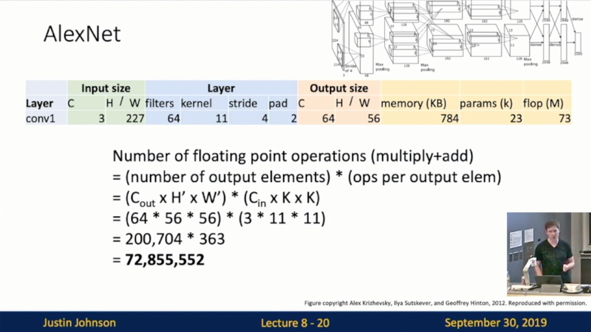  
        
        - Slide 8-25
            - Floating-point ops for pooling layer
            - Very small compared to convolution layer
        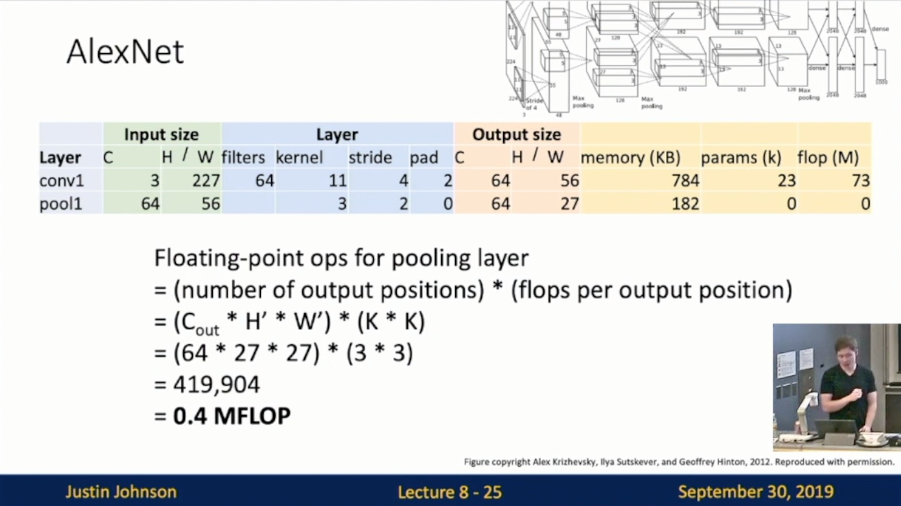  
        
        - Slide 8-26
            - Flatten output size
                - Flatten: destroy spatial structures
       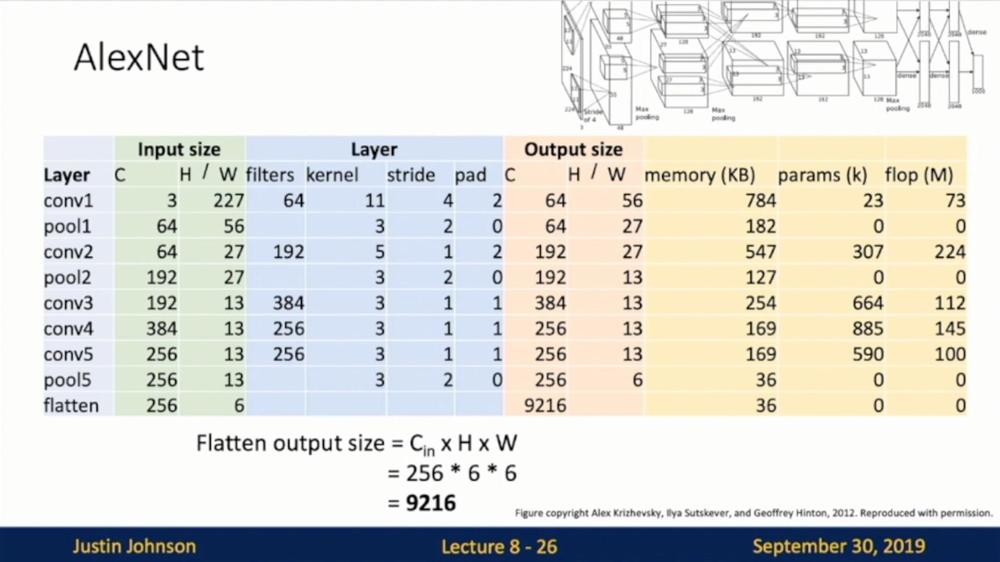  
       
       - Slide 8-30
            - Interesting trends
       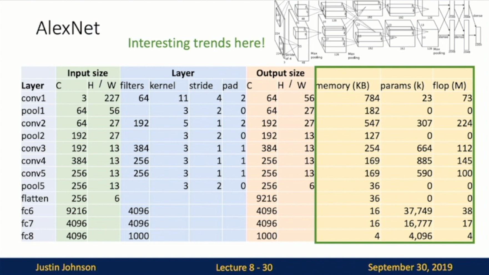  
    - Interesting trends
        - Slide 8-31
            - Most of the **memory usage** is in the early convolution layers
            - Nearly all **parameters** are in the fully-connected layers
            - Most **floating-point ops** occur in the convolution layers
        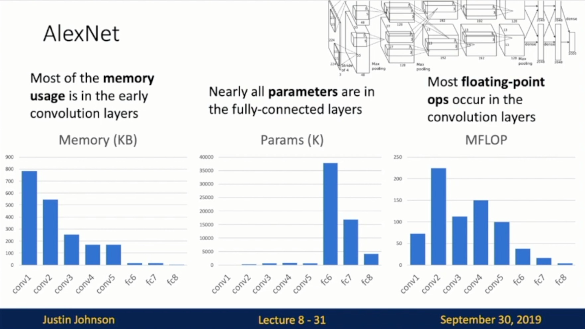  
- ZFNet (2013): A Bigger AlexNet
    - Architecture
        - Slide 8-34
            - Stride 4 to stride 2
                - JJ: Less aggressive in terms of downsampling
            - Increase number of filters in later convolution layers
          
- VGG (2014): Deeper Networks, Regular Design
    - Architecture
        - Design rules
            - All conv are 3 * 3 stride 1 pad 1
            - All max pool are 2 * 2 stride 2
            - After pool, double #channels
        - 5 convolutional stages
            - Slide 8-38
            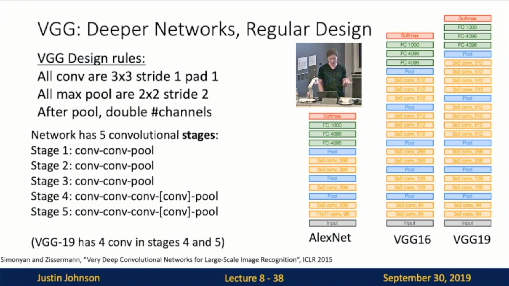  
    - Discussion on why choose such design rules
        - Slide 8-41
            - Topic: All conv are 3 * 3 stride 1 pad 1
            - Option 1: 
                - Conv(5 * 5, C -> C)
            - Option 2: Stack
                - Conv(3 * 3, C -> C)
                - Conv(3 * 3, C -> C)
                - JJ: equivalent to receptive fields of Option 1
            - Takeaway
                - Fewer learnable parameters
                - Cost less computation
                - JJ: Allows more non-linear convolution
            - Insight
                - Don’t need large filter. Use stack instead. 
                - Throw away hyperparameter kernel
        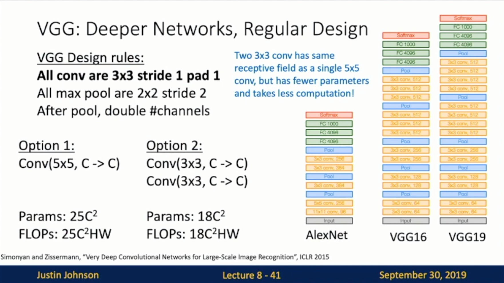  
        
        - Slide 8-44
            - Topic: 
                - All max pool are 2 * 2 stride 2
                - After pool, double #channels
            - Insight
                - JJ: By half spatial size and doubling the channel, we want each convolution to cost the same amount of FLOP 
        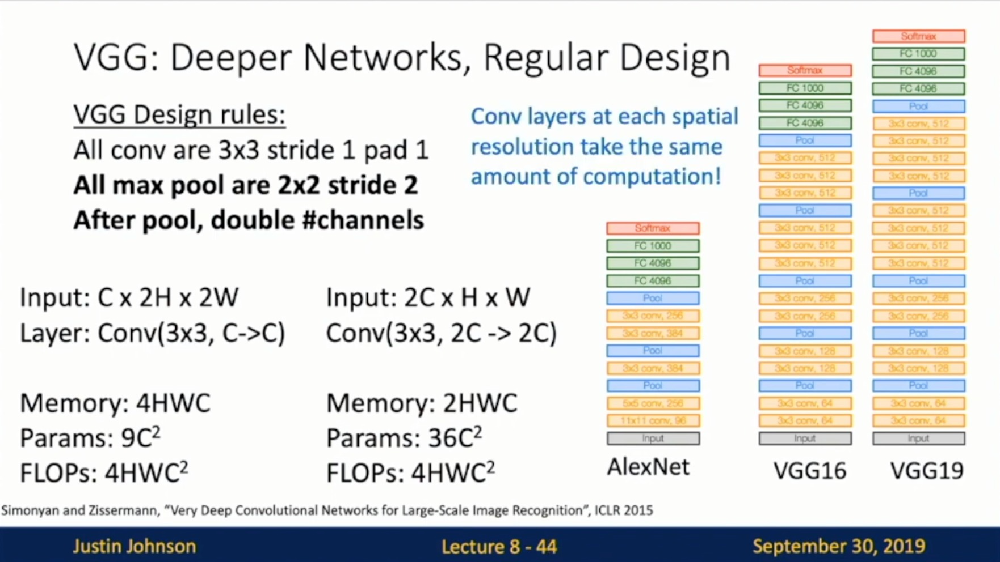  
        
        - Slide 8-45
            - AlexNet vs VGG-16
        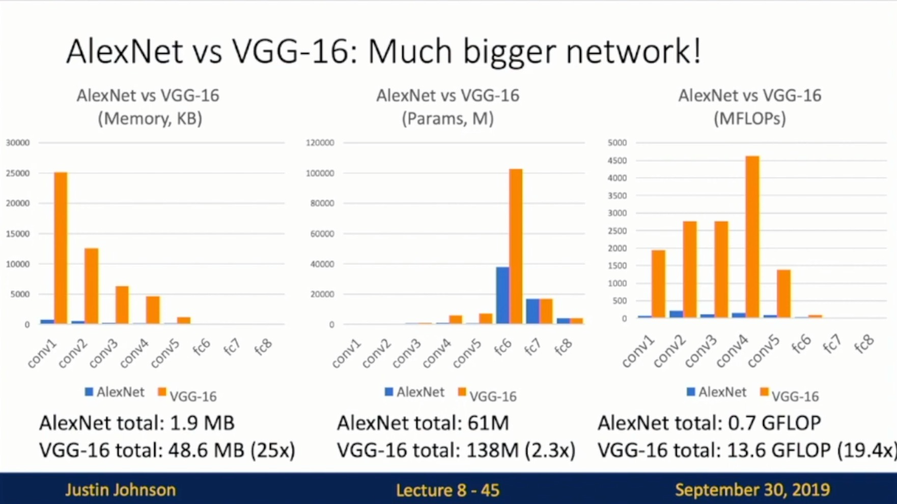  
- GoogLeNet (2014): Focus on Efficiency
    - Many innovations for efficiency: reduce parameter count, memory usage, and computation
    - Aggressive Stem: Slide 8-51
        - **Stem network** at the start aggressively downsamples input
            - Recall in VGG-16: Most of the compute was at the start
    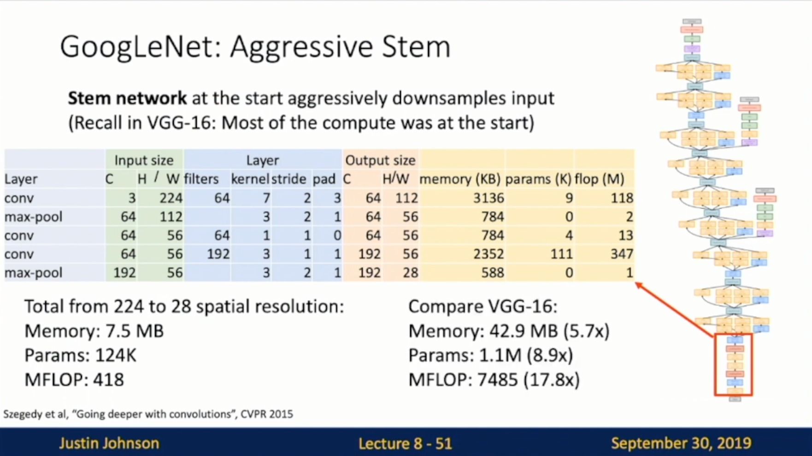  
    
    - Inception Module: Slide 8-53
        - Local unit with parallel branches
        - Local structure repeated many times throughout the network
        - Use 1*1 “Bottleneck” layers to reduce channel dimension before expensive conv (we will revisit this with ResNet!)
    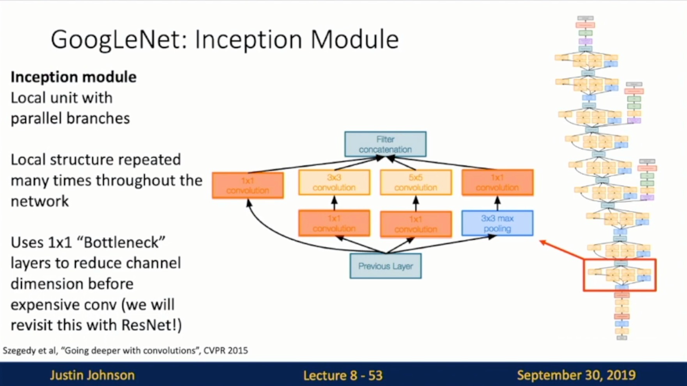  
    
    - Global Average Pooling: Slide 8-55
        - No large FC layers at the end! Instead uses **global average pooling** to collapse spatial dimensions, and one linear layer to produce class scores
            - Recall VGG-16: Most parameters were in the FC layers!
            - Eliminate a huge number of learnable parameters
    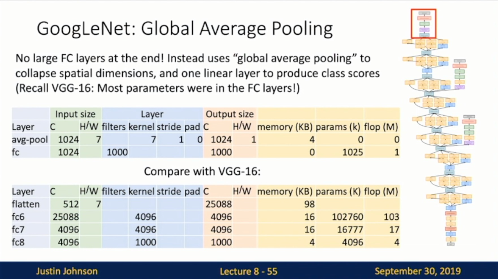  
    
    - Auxiliary Classifiers: Slide 8-56
        - Training using loss at the end of the network didn’t work well: Network is too deep, gradients don’t propagate cleanly
        - As a hack, attach “auxiliary classifiers” at several intermediate points in the network that also try to classify the image and receive loss
        - GoogLeNet was before batch normalization! With BatchNorm no longer need to use this trick
    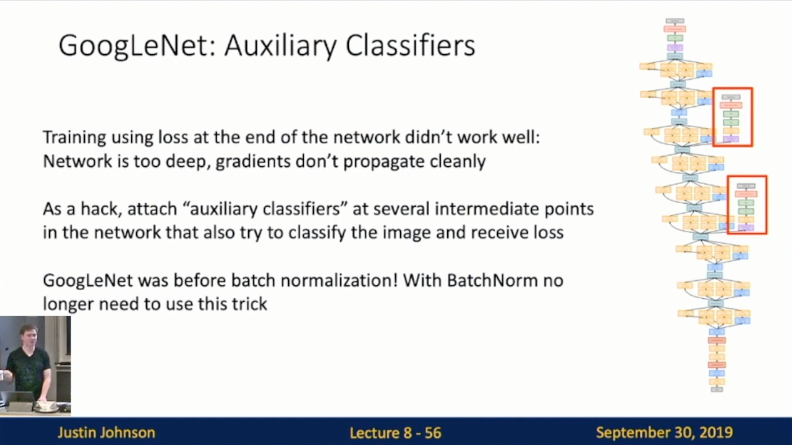  
- ResNet (2015): 
    - JJ: Batch normalization allows people to go deep
    - Residual Networks
        - Slide 8-60
            - Once we have Batch normalization, we can train networks with 10+ layers. What happens as we go deeper?
            - Deeper model does worse than shallow model!
            - Initial guess: Deep model is **overfitting** since it is much bigger than the other model
        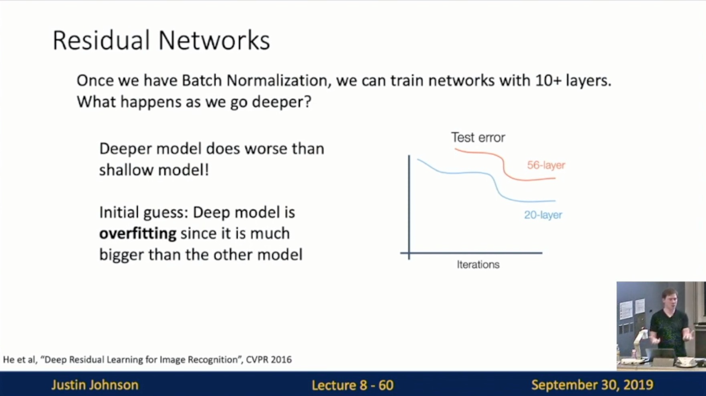  
        
        - Slide 8-61
            - In fact the deep model seems to be **underfitting** since it also performs worse than the shallow model on the training set! It is actually **underfitting**
        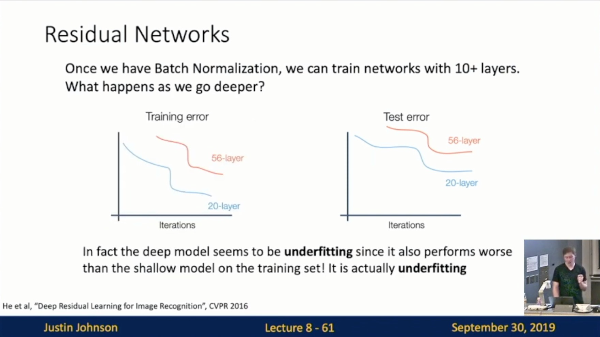  
        
        - 
            - Thus deeper models should do at least as good as shallow models
            - **Hypothesis**: This is an optimization problem. Deeper models are harder to optimize, and in particular don’t learn identity functions to emulate shallow models
            - **Solution**: Change the network so learning identity functions with extra layers is easy!
    - Architecture
        - Slide 8-65
            - “Plain” block vs. Residual Block
            - Additive “shortcut”: F(x) + x
                - Make it easy to emulate shallow models
        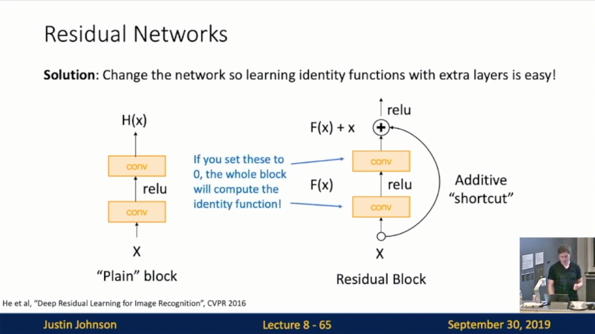  
    - Design: Slide 8-75
        - Basic Block
        - Bottleneck Block
            - More layers
            - More non-linearity
            - less computational cost
    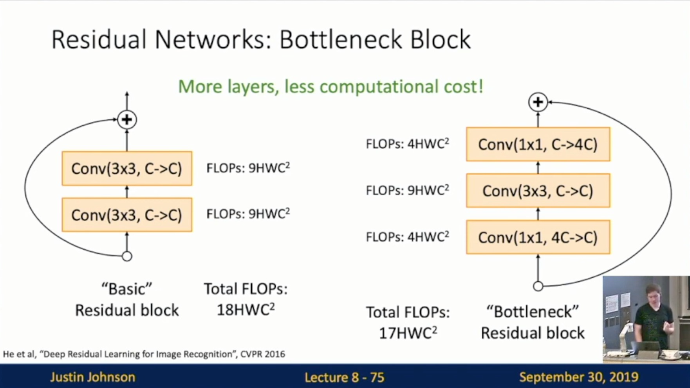  
    
    - Takeaway
        - Able to train very deep networks
        - Deeper networks do better than shallow networks (as expected)
        - Swept 1st place in all ILSVRC and COCO 2015 competitions
        - Still widely used today!
    - Block Design
        - Slide 8-81
    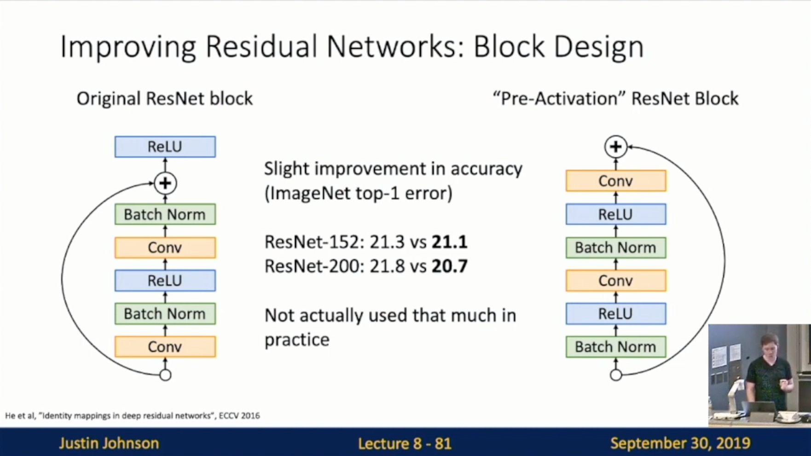  
    
- Improving ResNets: ResNeXt
    - Slide 8-94
        - G parallel pathways
    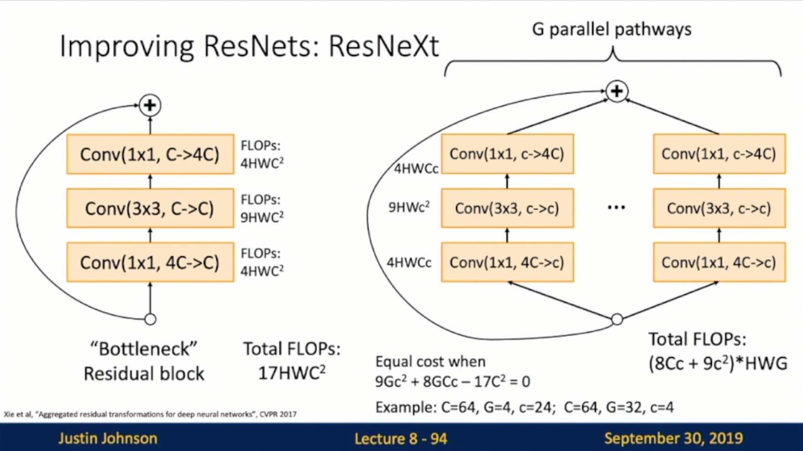  
    
    - Maintain computation by adding groups: Slide 8-101
        - Adding groups improves performance **with same computational complexity!**
    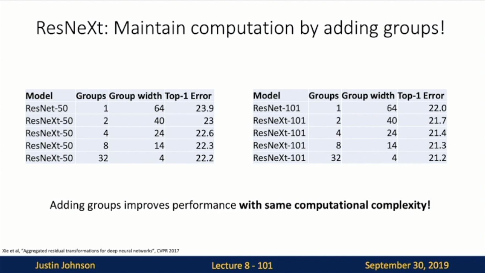  
- Densely Connected Neural Networks
    - Slide 8-105
        - JJ: Different way doing “shortcut connections”
    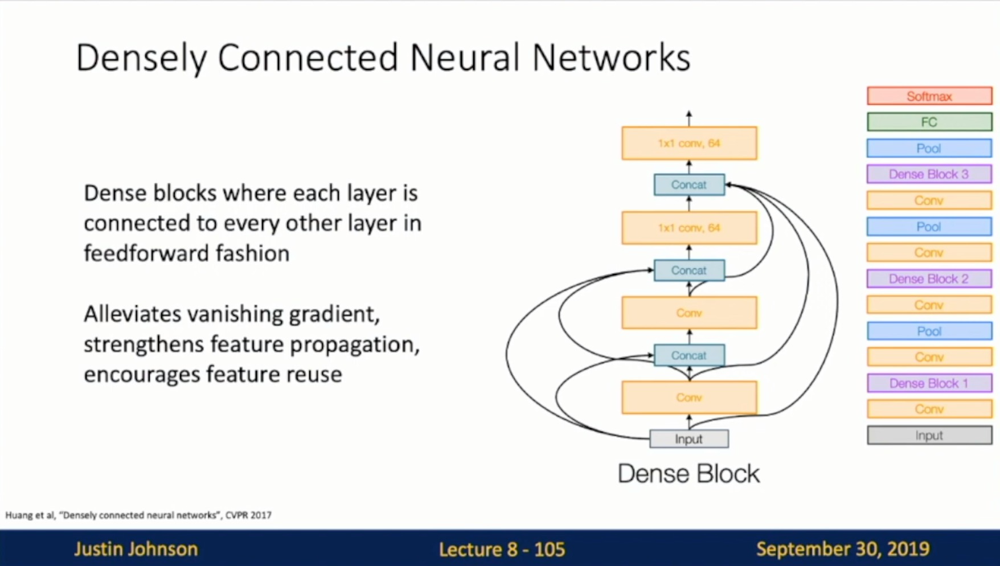  
    
- MobileNets: Tiny Networks (For Mobile Devices)
    - Slide 8-106
        - JJ: Sacrifice accuracy for low computational cost
    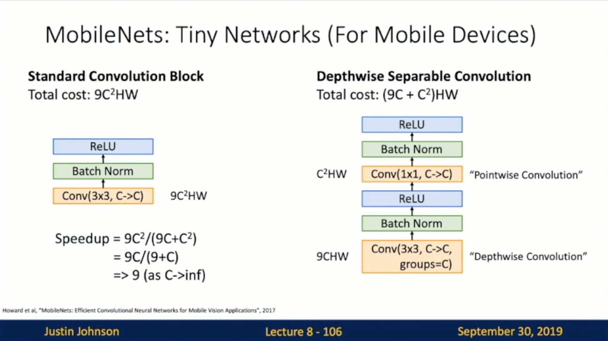  
- Neural Architecture Search
    - Slide 8-109
        - JJ: Automate designing
    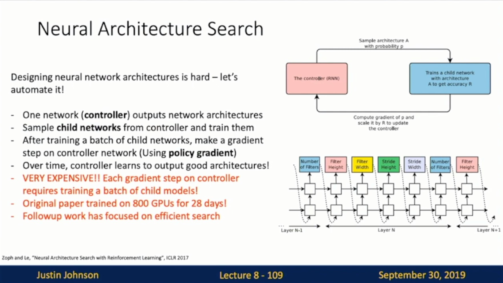  
    
    - Slide 8-110
        - Can be used to find efficient CNN architectures
    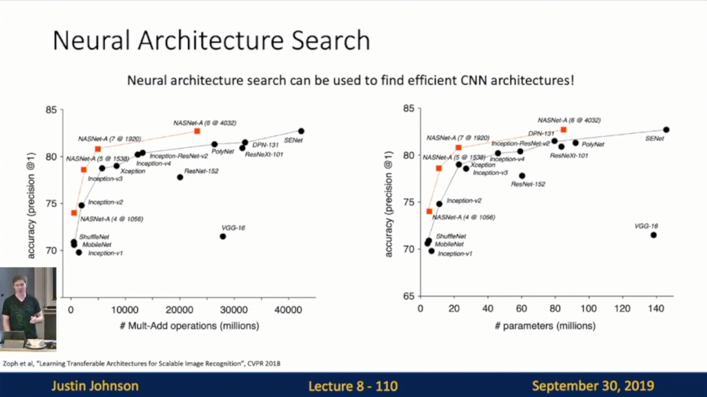  

**Summary**
- Early work (AlexNet -> ZFNet -> VGG) shows that **bigger networks work better**
- GoogLeNet one of the first to focus on **efficiency** (aggressive stem, 1 * 1 bottleneck convolutions, global average pool instead of fully-connected layers)
- ResNet showed us how to train extremely deep networks - limited only by GPU memory! Started to show diminishing returns as networks got bigger
- After ResNet: **Efficient networks** became central: how can we improve the accuracy without increasing the complexity?
- Lots of **tiny networks** aimed at mobile devices: MobileNet, ShuffleNet, etc
- **Neural Architecture Search** promises to automate architecture design

**Which Architecture should I use?**
- **Don’t be a hero.** For most problems you should use an off-the-shelf architecture; don’t try to design your own!
- If you just care about accuracy, **ResNet-50** or **ResNet-101** are great choices
- If you want an efficient network (real-time, run on mobile, etc) try **MobileNets** and **ShuffleNets** 
