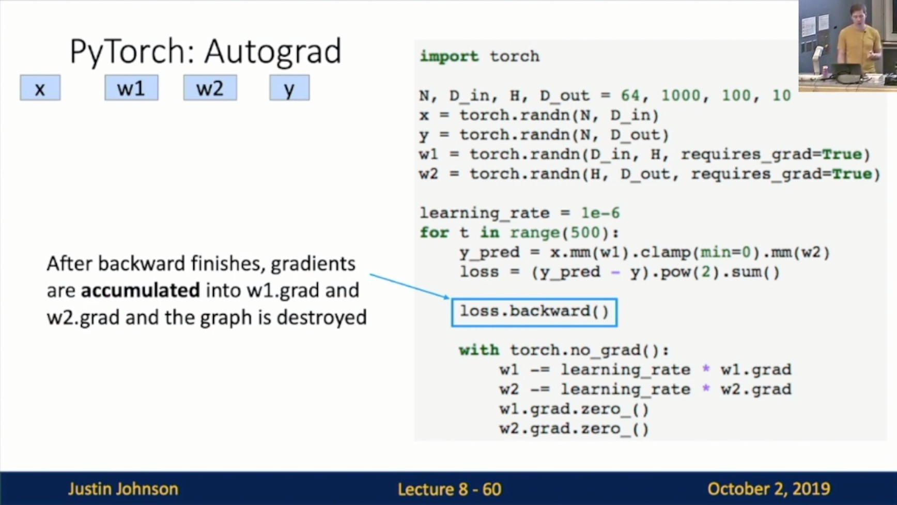
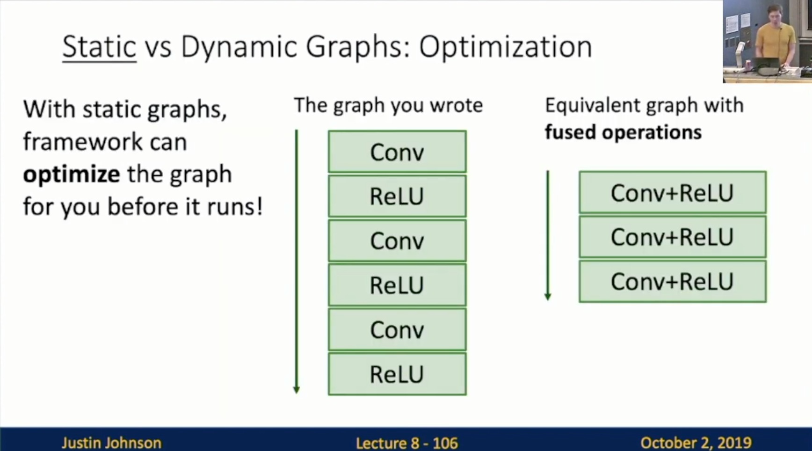

Michigan Online  
Deep Learning for Computer Vision  
Instructor: Justin Johnson  

Lecture 9: Hardware and Software
    
**DL Hardware**
- Inside a computer
    - CPU: “Central Processing Unit”
    - GPU: “Graphics Processing Unit”
        - NVIDIA vs. AMD
            - DL clear winner: NVIDIA
        - Slide 9-11: GigaFLOPs per Dollar
         
    - CPU vs GPU
        - CPU: Fewer cores, but each core is much faster and much more capable; great at sequential tasks
        - GPU: More cores, but each core is much slower and “dumber”; great for parallel tasks
- Inside a GPU
    - RTX Titan
        - 12 * 2GB memory modules
        - Processor
            - 72 Streaming multiprocessors (SMs)
                - 64 FP32 cores per SM
                - 8 Tensore Core per SM
- **Tensor Core**: Special hardware!
    - Slide 9-21, 9-22
     
     
    
    - Slide 9-24: GigaFLOPs per Dollar
     
- Example: Matrix Multiplication
    - Slide 9-25
        - Perfect for GPUs! All output elements are independent, can be trivially parallelized
     
- Programming GPUs
    - CUDA (NVIDIA only)
        - Write C-like code that runs directly on the GPU
        - NVIDIA provides optimized APIs: cuBLAS, cuFFT, cu DNN, etc
    - OpenCL
        - Similar to CUDA, but runs on anything
        - Usually slower on NVIDIA hardware
    - EECS 598.009: Applied GPU Programming
- Scaling up: Typically 8 GPUs per server
- Google Tensor Processing Units (TPU)
    - Special hardware for matrix multiplication, similar to NVIDIA Tensor Cores; also runs in mixed precision (bfloat16)
    - Cloud TPU v2: $4.50/hour
    - Cloud TPU v2 Pod: $384/hour
    - Cloud TPU v3: $8/hour
    - Cloud TPU v3 Pod: Talk to a sales rep
    - In order to use TPUs, you have to use TensorFlow (for now)

**DL Software**
- A zoo of frameworks!
    - Caffe(UC Berkley) —> Caffe2(Facebook)
    - Torch(NYU/Facebook) —> PyTorch(Facebook)
    - Theno(U Montreal) —> TensorFlow(Google)
    - JAX(Google)
- Mainstream frameworks
    - PyTorch
    - TensorFlow
- The point of DL frameworks
    1. Allow rapid prototyping of new ideas
    2. Automatically compute gradients for you
    3. Run it all efficiently on GPU (or TPU)
- PyTorch
    - Versions
        - For this class we are using **PyTorch version 1.2**
        - Be careful if you are looking at older PyTorch code
    - Fundamental Concepts
        - **Tensor**: Like a numpy array, but can run on GPU
        - **Autograd**: Package for building computational graphs out of Tensors, and automatically computing gradients
        - **Module**: A neural network layer; may store state or learnable weights
    - Tensors
        - Running example: Train a two-layer ReLU network on random data with L2 loss
        - Slide 9-44: Create random tensors for data and weights 
         
        
        - Slide 9-45: Foward pass: compute predictions and loss
         
        
        - Slide 9-46: Backward pass: manually compute gradients
         
        
        - Slide 9-47: Gradient descent step on weights
         
        
        - Slide 9-48: To run on GPU, just use a different device!
         
    - Autograd
        - Slide 9-49: Creating Tensors with requires_grad=True enables autograd
         
        
        - Slide 9-50
         
        
        - Slide 9-51: Forward pass
        
        
        - Slide 9-52: Backward pass
        
        
        - Slide 9-53: mm
        
        
        - Slide 9-54: clamp
        
        
        - Slide 9-55: mm
        
        
        - Slide 9-56: pred
        
        
        - Slide 9-57: pow
        
        
        - Slide 9-58: sum
        
        
        - Slide 9-59: Backprop to all inputs that require grad
        
        
        - Slide 9-60 
            - After backward finishes, gradients are **accumulated** into w1.grad and w2.grad and the graphs is destroyed 
        
        
        - Slide 9-61: Make gradient step on weights
        
        
        - Slide 9-62: Set gradients to zero - forgetting this is a common bug!
        
        
        - Slide 9-63: Tell PyTorch not to build a graph for these operations
        
    - Autograd: Sigmoid
        - Slide 9-65
            - Can define new  operations using Python functions
                - JJ: Can be numerically unstable
        
        
        - Slide 9-67
            - Use the PyTorch version
        
        
        - In practice this is pretty rare - in most cases Python functions are good enough
    - nn Module
        - Slide 9-69
            - Higher-level wrapper for working with neural nets
            - Use this! It will make your life easier
        
        
        - Slide 9-70: Object-orientd API
        
        
        - Slide 9-71: Forward pass
        
        
        - Slide 9-72: Loss functions
        
        
        - Slide 9-73: Backward pass
        
        
        - Slide 9-74: Make gradient step on each model parameter (w/ gradients disabled)
        
    - optim Module
        - Slide 9-75: Use an **optimizer** for different update rules
        
        
        - Slide 9-76: After computing gradients, use optimizer to update and zero gradients
        
    - Define your own nn Module
        - Slide 9-77: Very common to define your own models or layers as custom Modules 
        
        
        - Slide 9-78
        
        
        - Slide 9-79
        
        
        - Slide 9-80
            - No need to define backward - autograd will handle it
        
        
        - Slide 9-81: Very common to mix and match custom Module subclasses and Sequential containers
        
        
        - Slide 9-82
            - JJ: Not a practical example
        
        
        - Slide 9-83: Very easy to quickly build complex network architectures
        
    - DataLoaders
        - Slide 9-84
            - A **DataLoader** wraps a **Dataset** and provides minibatching, shuffling, multithreading for you
            - When you need to load custom data, jsut write your own Dataset class
        
    - Pretrained Models: Super easy to use pretrained models with torchvision
        - Slide 9-87
        
    - Dynamic Computation Graphs
        - Slide 9-97
            - Dynamic graphs let you use regular Python control flow during the forward pass!
        
    - Alternative: Static Computation Graphs
        - Slide 9-100
        
    - Static Graphs with JIT
        - Slide 9-102: Lots of magic
        
    - Static(for) vs Dynamic Graphs: Optimization
        - Slide 9-106
        
    - Static(for) vs Dynamic Graphs: Serialization
        - Slide 9-107
        
    - Static(downside) vs Dynamic Graphs: Debugging
        - Slide 9-108
        
    - Dynamic Graph Applications
        - Model structure depends on the input
            - Recurrent Networks: Slide 9-109
            
            
            - Recursive Networks: Slide 9-110
            
            
            - Modular Networks: Slide 9-111
            
- TensorFlow
    - Versions
        - TensorFlow 1.0
            - Default: static graphs
        - TensorFlow 2.0
            - Default: dynamic graphs
